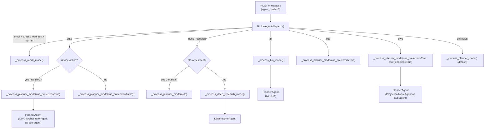

The `agent_mode` field on `POST /messages` is the primary dispatch signal. The `BrokerAgent` reads it, enforces plan restrictions, and starts the correct specialist. Most modes ultimately route through `PlannerAgent` with different capability flags; `deep_research` and `llm` have their own paths.

## Mode overview

| Mode | Specialist | CUA available | SWE available | Hibernatable |
|------|-----------|--------------|--------------|-------------|
| `auto` | `PlannerAgent` | Yes (if device online) | No | Yes |
| `cua` | `PlannerAgent` | Yes (forced) | No | Yes |
| `llm` | `PlannerAgent` | No | No | Yes |
| `deep_research` | `DataFetcherAgent` | No | No | Yes |
| `swe` | `PlannerAgent` | Yes | Yes | Yes |
| `mcp` | `MCPToolsAgent` (via Planner) | No | No | Yes |
| `ask_human` | None (pass-through) | — | — | — |

`BLOCKABLE_AGENT_MODES` (source: `Agent/BrokerAgent/broker.py` line 112):

```python
BLOCKABLE_AGENT_MODES = {"auto", "cua", "llm", "deep_research", "swe"}
```

Only these five modes can be blocked via a plan's `forbidden_agent_modes` policy. `mcp` and `ask_human` are not listed and cannot be disabled per-plan.

## Routing logic



## Mode descriptions

### `auto`

**Default when no mode is specified.**

Routes to `PlannerAgent`. The broker makes a live RPC call to check the current device status (not the stale payload snapshot). If the device is `online` or `connected`, CUA is enabled as the primary tool. If offline, CUA is disabled and the planner uses API-only tools.

The planner autonomously decides whether to delegate to `CUA_OrchestratorAgent` or use MCP tools or both.

```python
# From broker.py
live_status = await self._get_current_device_status(payload.device.device_id)
auto_cua_preferred = live_status in ("online", "connected")
return await self._process_planner_mode(payload, worker_id, cua_preferred=auto_cua_preferred)
```

**Best for:** General-purpose tasks where the agent should pick the right approach.

### `cua`

Forces `PlannerAgent` with `cua_preferred=True`, regardless of device status. The planner always has `CUA_OrchestratorAgent` available as its primary sub-agent.

Use this when the task requires GUI interaction and you know the device is online.

**Best for:** Screen automation, form filling, browser navigation.

### `llm`

Routes to `PlannerAgent` with no CUA capability. Pure language model reasoning — no device actions, no screen interaction. Only text-in / text-out plus any configured API tools.

The LLM mode also supports ARCH-001 hibernation: `agent_id` is set to `session_id` to enable state restoration across worker bounces.

**Best for:** Writing, analysis, summarisation, questions that don't require device access.

### `deep_research`

Routes to `DataFetcherAgent`. This agent is specialised for multi-step information gathering: it runs structured web searches, fetches URLs, aggregates data from multiple sources, and returns a synthesised report.

**Intent reclassification (bug fix B3):** If the latest user message signals a file-write, command-execution, or non-research action (detected by `_should_exit_deep_research`), the broker reclassifies the request as `auto` and routes to `PlannerAgent` instead. This prevents the DataFetcher (which has no `write_file` / `execute_command` tools) from hallucinating task completion.

```python
if latest_user_msg and self._should_exit_deep_research(latest_user_msg):
    # Fall through to PlannerAgent with live CUA check
    return await self._process_planner_mode(payload, worker_id, ...)
return await self._process_deep_research_mode(payload, worker_id)
```

**Best for:** Research tasks, competitor analysis, data aggregation from the web.

### `swe`

Routes to `PlannerAgent` with `swe_enabled=True`. The planner has `ProjectSoftwareAgent` available as a sub-agent alongside `CUA_OrchestratorAgent`. Software engineering tools include code reading, generation, refactoring, and terminal command execution.

**Best for:** Code review, writing scripts, debugging, file generation.

### `mcp`

Routes through the planner with Composio MCP toolkit access. The planner delegates to `MCPToolsAgent` for tool calls against connected integrations (Gmail, GitHub, Slack, etc.).

`mcp` is **not** in `BLOCKABLE_AGENT_MODES` — it cannot be restricted per plan. However, individual toolkits can be disabled via `forbidden_mcp_providers` in the plan policy.

**Best for:** Email automation, calendar management, GitHub operations, any Composio-backed integration.

### `ask_human`

A pass-through mode that does not start any specialist agent. Instead, it creates an `ask_human` ChatMessage directly. Used by the agent internally when it needs user input before proceeding.

This mode is not typically sent by the frontend directly. The agent emits it via `communicate(wait_for_reply=True)`.

## Plan restrictions

Plans can restrict which modes are available via the `allowed_agent_modes` JSON field on `SubscriptionPlan`. When a mode is not in the allowed list, the BrokerAgent returns an error before dispatching.

```python
# From broker.py
forbidden_agent_modes = [
    name for name in policy_meta.get("forbidden_agent_modes", [])
    if name in self.BLOCKABLE_AGENT_MODES
]
if agent_mode in forbidden_agent_modes:
    # Return error: agent_mode_forbidden
```

Example plan config:
```json
{
  "allowed_agent_modes": ["auto", "llm", "mcp"]
}
```

A user on this plan cannot use `cua`, `deep_research`, or `swe` modes. The API returns:

```json
{
  "error": "agent_mode_forbidden",
  "agent_mode": "cua",
  "message": "Agent mode 'cua' is disabled for this session."
}
```

## Compute V2 (session sandbox)

When Compute V2 is enabled for a session (detected by `_is_compute_v2_agent_enabled`), the broker creates a `SESSION_SANDBOX` device alongside the primary device. The session sandbox runs in a fresh E2B sandbox that is torn down at the end of the session.

`deep_research` mode does not use Compute V2 (it has no need for a desktop sandbox).

```python
if self._is_compute_v2_agent_enabled(payload) and agent_mode != "deep_research":
    cua_preferred = agent_mode in ("cua", "auto") or live_status in ("online", "connected")
    swe_enabled = agent_mode == "swe"
    # ... create SESSION_SANDBOX device
```

## Specialist agents

All specialists extend `BaseAgent` (source: `Agent/Agents/BaseAgent/base.py`).

### `CUA_OrchestratorAgent`

Located at `Agent/Agents/CUA_OrchestratorAgent/`. Handles computer-use automation: takes screenshots, interprets them with a vision model, and emits click/type/scroll actions. Operates at the Orchestrator level — it may internally use Supervisor and Performer patterns to break complex tasks into atomic actions.

### `PlannerAgent`

Located at `Agent/Agents/PlannerAgent/`. The high-level orchestrator for `auto`, `cua`, `llm`, and `swe` modes. Classifies the task and delegates to the most appropriate sub-agent. Maintains a persistent reasoning history keyed by `session_id` in Redis for hibernation and cross-worker resumption.

### `DataFetcherAgent`

Located at `Agent/Agents/DataFetcherAgent/`. Used exclusively for `deep_research` mode. Specialised for structured web retrieval: search, fetch, parse, aggregate. Does not have device action tools.

### `MCPToolsAgent`

Located at `Agent/Agents/MCPToolsAgent/`. Manages the Composio toolkit registry (`_REMOTE_TOOL_MANAGER_REGISTRY`). Applies toolkit toggle policy (`apply_toolkit_toggle_for_user`) so that disabled integrations are excluded from the LLM's tool list.

### `ProjectSoftwareAgent`

Located at `Agent/Agents/ProjectSoftwareAgent/`. Software engineering specialist. Has tools for reading files, writing code, running terminal commands, and managing git operations. Used when `swe_enabled=True` in the planner.

## Hibernation support

All blockable modes support ARCH-001 hibernation. When the agent encounters an `ask_human` or waits for a long-running external event:

1. Agent state is serialised to Redis under `agent_history:{session_id}`.
2. Agent transitions to `HIBERNATED`.
3. The BrokerAgent releases the worker (available for other sessions).
4. On user reply or external event, the `BrokerWaker` pushes a wake message to the session inbox.
5. Any available worker picks up the job, restores state from Redis, and continues.

The key that enables this is `agent_id = session_id` (set explicitly in each mode's dispatch function), ensuring that the correct Redis key is used for save/restore across worker bounces.

## Gotchas

<Warning>
**`deep_research` is sticky per session.** Once a session is tagged as `deep_research` in the original payload, follow-up messages arrive with the same mode. The intent reclassifier (`_should_exit_deep_research`) runs on every follow-up to detect when the conversation has shifted to non-research actions. If the heuristic misses an edge case, the DataFetcher will receive tool calls it cannot fulfill.
</Warning>

<Note>
**`auto` device check is live, not stale.** The `auto` mode makes an RPC call to fetch the current device status at dispatch time — it does not trust the `device.connection_status` value in the payload (which may be seconds stale). Use `auto` for general tasks; use `cua` only when you know the device is available.
</Note>

<Warning>
**Mock modes are not production modes.** `mock`, `stress`, `load_test`, and `no_llm` are internal testing modes. They are hardcoded to random delays and preset responses. Do NOT send these modes from a production client — they bypass all billing, safety, and tool logic.
</Warning>

## Selecting a mode from the frontend

The `agent_mode` is sent as part of the message request body (or as a query param in some integrations):

<CodeGroup>

```json Auto (default)
{
  "session_id": "session-uuid",
  "content": "Find me the cheapest flight to Tokyo next week",
  "agent_mode": "auto"
}
```

```json Computer Use
{
  "session_id": "session-uuid",
  "content": "Open Chrome and fill out the form at payments.example.com",
  "agent_mode": "cua"
}
```

```json Research
{
  "session_id": "session-uuid",
  "content": "Summarise the top 5 AI papers from this month",
  "agent_mode": "deep_research"
}
```

```json Software Engineering
{
  "session_id": "session-uuid",
  "content": "Refactor auth.py to use dependency injection",
  "agent_mode": "swe"
}
```

</CodeGroup>

## Mode × device type matrix

| Mode | REAL_DEVICE (online) | REAL_DEVICE (offline) | E2B_SANDBOX | SESSION_SANDBOX |
|------|---------------------|----------------------|------------|-----------------|
| `auto` | CUA enabled | CUA disabled | CUA enabled | CUA enabled |
| `cua` | CUA enabled | Error: device offline | CUA enabled | CUA enabled |
| `llm` | No CUA | No CUA | No CUA | No CUA |
| `deep_research` | No CUA | No CUA | No CUA | No CUA |
| `swe` | CUA + SWE | SWE only | CUA + SWE | CUA + SWE |
| `mcp` | Tools only | Tools only | Tools only | Tools only |

## Internal modes (testing only)

| Mode | Purpose |
|------|---------|
| `mock` | Random sleep + preset response; no LLM or tools |
| `stress` | Alias for `mock`; used in load tests |
| `load_test` | Alias for `mock` with configurable delay |
| `no_llm` | Skip LLM, return empty response immediately |

These modes bypass billing, safety, and all tool logic. They are gated to non-production environments via config.

## Policy override examples

An admin can restrict a session or plan to specific modes via `forbidden_agent_modes` in `meta_data`:

```json
{
  "forbidden_agent_modes": ["cua", "swe"],
  "forbidden_tools": ["write_file", "execute_command"],
  "forbidden_mcp_providers": ["github"]
}
```

This configuration:
- Blocks `cua` and `swe` modes (returns `agent_mode_forbidden` error).
- Removes `write_file` and `execute_command` from the agent's tool list.
- Removes the GitHub Composio toolkit from `MCPToolsAgent`.

The BrokerAgent enforces these restrictions before any LLM call is made.

## Mode and sub-agent mapping

The BrokerAgent's `_process_planner_mode` function controls which sub-agents are available to `PlannerAgent` based on mode flags:

```python
# Simplified from broker.py
planner = PlannerAgent(
    config=runtime_config,
    cua_preferred=cua_preferred,   # True for cua, auto+online, swe
    swe_enabled=swe_enabled,       # True only for swe
    initial_device_status=live_status,
)
```

The `PlannerAgent` then presents to the LLM only the sub-agents that are enabled. For `llm` mode, neither CUA nor SWE sub-agents are registered.

## `deep_research` intent reclassification

The reclassifier (`_should_exit_deep_research`) runs on the latest user message text. It detects non-research intents using keyword heuristics:

- File system operations: "сохрани", "save", "write", "create file"
- Terminal operations: "run", "execute", "запусти"
- GUI actions: "нажми", "click", "open app"

When detected, the mode is silently reclassified to `auto` for that message only — the session's original `agent_mode` is preserved in the payload for subsequent messages.

This ensures `DataFetcherAgent` is never asked to execute actions outside its tool registry (preventing the "tool not found → hallucinated success" failure pattern).

## LLM provider by mode

`ModelRouter` uses the model profile to pick the LLM. The effective call classification per mode:

| Mode | Typical classification | Provider priority |
|------|----------------------|------------------|
| `auto` | balanced | Claude Sonnet → GPT-4o → Gemini Flash |
| `cua` | balanced (vision required) | Claude Sonnet → GPT-4o |
| `llm` | economy or balanced | Gemini Flash → Claude Sonnet |
| `deep_research` | long-context | Gemini 2.5 Pro → Claude Opus |
| `swe` | premium (heavy reasoning) | Claude Opus → GPT-4.7 |
| `mcp` | tool-capable | Claude Sonnet → GPT-4o |

Premium calls (heavy reasoning) are capped per session. The `swe` mode is most likely to hit the premium cap.

## Mode selection UX

The recommended UX pattern:

1. Default to `auto` for all user messages.
2. Let users explicitly switch to `cua`, `swe`, `deep_research`, or `mcp` via a mode picker.
3. Hide modes that are blocked by the plan (`allowed_agent_modes`).
4. Show an upgrade prompt when the user selects a blocked mode.

The `GET /billing/status` response includes `allowed_agent_modes` from the active plan, which the frontend can use to show/hide mode options without making a separate API call.

## Error responses

When an agent mode is forbidden, the backend returns:

```json
{
  "error": "agent_mode_forbidden",
  "agent_mode": "swe",
  "message": "Agent mode 'swe' is disabled for this session."
}
```

When an unknown mode is sent, the broker falls through to `_process_planner_mode()` with default flags — no error is raised, but CUA and SWE are both disabled.

## Sending a message with a specific mode

<CodeGroup>

```bash cURL
curl -X POST https://api.skygen.ai/messages \
  -H "Authorization: Bearer $TOKEN" \
  -H "Content-Type: application/json" \
  -d '{
    "session_id": "session-uuid",
    "content": "Analyse the latest NVIDIA earnings report",
    "agent_mode": "deep_research"
  }'
```

```javascript JavaScript
const response = await fetch('/messages', {
  method: 'POST',
  headers: {
    'Authorization': `Bearer ${token}`,
    'Content-Type': 'application/json',
  },
  body: JSON.stringify({
    session_id: sessionId,
    content: 'Analyse the latest NVIDIA earnings report',
    agent_mode: 'deep_research',
  }),
});
```

```python Python
import httpx

resp = httpx.post(
    "https://api.skygen.ai/messages",
    headers={"Authorization": f"Bearer {token}"},
    json={
        "session_id": session_id,
        "content": "Analyse the latest NVIDIA earnings report",
        "agent_mode": "deep_research",
    },
)
```

</CodeGroup>

## Checking allowed modes before dispatching

Read the user's allowed modes from the billing status endpoint and filter the mode picker accordingly:

```javascript
// On app load
const billing = await fetch('/billing/status').then(r => r.json());
const allowedModes = billing.allowed_agent_modes ?? ['auto', 'cua', 'llm', 'deep_research', 'swe', 'mcp'];

// Hide or disable mode buttons not in the allowed list
const allModes = ['auto', 'cua', 'llm', 'deep_research', 'swe', 'mcp'];
const visibleModes = allModes.filter(m => allowedModes.includes(m));
```

If `allowed_agent_modes` is `null` in the billing status response, all modes are permitted (backward-compatible default for plans created before the field was added).

## Compute V2 mode matrix

When `_is_compute_v2_agent_enabled` returns `true`, the session gets a `SESSION_SANDBOX` device automatically. The matrix below shows how Compute V2 interacts with each mode:

| Mode | SESSION_SANDBOX created | Notes |
|------|------------------------|-------|
| `auto` | Yes (if Compute V2 enabled) | `cua_preferred` follows live device status |
| `cua` | Yes | `cua_preferred=True` always |
| `llm` | Yes | Sandbox exists but CUA disabled |
| `swe` | Yes | `swe_enabled=True`; sandbox used for terminal |
| `deep_research` | No | Explicitly excluded — DataFetcher needs no desktop |
| `mcp` | Yes | Tools may invoke Composio; sandbox unused |

## See also

- [Agents](/concepts/agents) — the BrokerAgent architecture, LLM routing, and hibernation
- [Billing](/concepts/billing) — `allowed_agent_modes` per plan
- [Devices](/concepts/devices) — how `cua` mode checks device status before dispatching
- [Confirmations](/concepts/confirmations) — how agent modes park execution for user input
