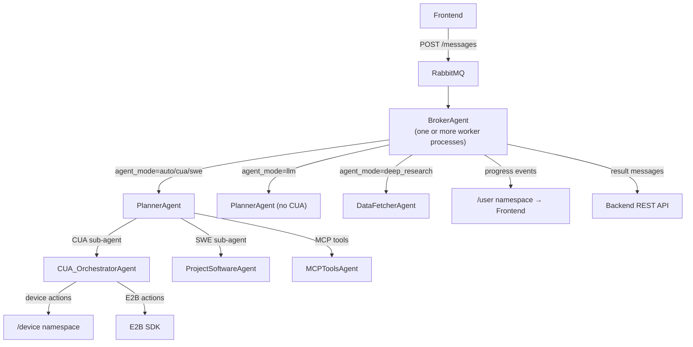
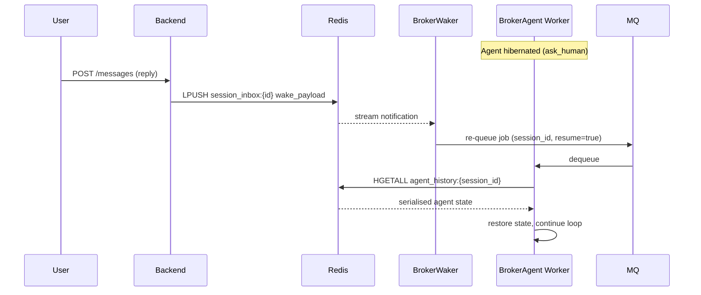

An **agent** is the reasoning loop between a user message and the actions Skygen performs on a device. The `BrokerAgent` process consumes jobs from RabbitMQ, picks the right specialist agent for the task, routes LLM calls to one of five providers, submits device actions, and streams progress back to the user in real time.

## Architecture

Skygen uses a **hierarchical dispatch pattern**:

1. **`BrokerAgent`** — the main worker. Listens on RabbitMQ, maintains per-agent inboxes, and routes each incoming `AgentProcessingPayload` to a specialist based on `agent_mode`.
2. **Specialist agents** — one per mode:
   - **CUA_OrchestratorAgent** — computer-use automation (click, type, screenshot); may delegate to Supervisor → Performer.
   - **PlannerAgent** — multi-step research; delegates to DataFetcher.
   - **DataFetcherAgent** — structured API/web data retrieval.
   - **MCPToolsAgent** — MCP tool calling (Composio toolkits, custom connectors).
   - **ProjectSoftwareAgent** — code analysis, generation, refactoring.
3. **`ModelRouter`** — picks the LLM based on task requirements (reasoning depth, context length, vision), model profile, and per-session premium-call budget.



## Agent classes

Source: `Agent/Agents/`

| Class | Path | Used for |
|-------|------|---------|
| `BaseAgent` | `Agent/Agents/BaseAgent/base.py` | Abstract base; FADA loop, LLM routing, state |
| `PlannerAgent` | `Agent/Agents/PlannerAgent/` | `auto`, `cua`, `llm`, `swe` modes |
| `DataFetcherAgent` | `Agent/Agents/DataFetcherAgent/` | `deep_research` mode |
| `MCPToolsAgent` | `Agent/Agents/MCPToolsAgent/` | Composio tool calls |
| `CUA_OrchestratorAgent` | `Agent/Agents/CUA_OrchestratorAgent/` | Screen automation |
| `ProjectSoftwareAgent` | `Agent/Agents/ProjectSoftwareAgent/` | Code read/write/run |

### BaseAgent

All specialist agents inherit from `BaseAgent` (`Agent/Agents/BaseAgent/base.py`). Key properties:

- `agent_id` — UUID identifying the agent; set to `session_id` for hibernation/restore.
- `max_iter = 100` — maximum ReAct loop iterations before the agent is forced to terminate.
- `TERMINATE_GUARD_ENABLED = False` — safety check that prevents premature termination (off by default; enable for production agents that must validate work before reporting DONE).
- `inbox` — async queue for messages from the BrokerWaker (wake events, user follow-ups).
- `_forbidden_agent_modes` / `_forbidden_tools` / `_forbidden_mcp_providers` — policy lists injected by `BrokerAgent._apply_agent_mode_policy`.

### BrokerAgent

Source: `Agent/BrokerAgent/broker.py`

Central coordinator. Constructed once per agent process, handles multiple sessions concurrently via async workers.

**Key internals:**

| Attribute | Type | Purpose |
|-----------|------|---------|
| `_active_agent_inboxes` | `dict[session_id → Queue]` | Deliver wake events to hibernating agents |
| `_pending_pauses` | `dict` | Sessions blocked on `ask_human` |
| `HibernationController` | Service | Manages agent sleep/wake lifecycle |
| `DeviceLockManager` | Service | Prevents two agents from controlling the same device simultaneously |
| `SessionLockManager` | Service | Prevents two jobs from running in the same session simultaneously |
| `CloudPcBindingManager` | Service | Manages the session ↔ Cloud PC binding lock |

## Agent modes

The `agent_mode` header on `POST /messages` picks the specialist:

| Mode | What it does | Typical LLM |
|------|--------------|-------------|
| `auto` | Route by content; detect whether GUI, API, or code is needed | Adaptive |
| `cua` | Computer-use: screenshots, clicks, typing on the device | Balanced (Claude Sonnet, GPT-4o) |
| `deep_research` | Multi-step research, long context aggregation | Long-context model |
| `mcp` | Run MCP tools against connected integrations | Tool-capable (Claude, GPT) |
| `swe` | Code reading and generation | Heavy reasoning (Claude Opus, GPT-4.7) |
| `llm` | Pure LLM, no device access | Any |
| `ask_human` | Pause the worker and wait for user input | No LLM |

See [Agent modes](/concepts/agent-modes) for the full routing logic.

## Multi-LLM routing

`ModelRouter` classifies each call as **premium**, **balanced**, or **economy** based on what the caller asked for (`requires_heavy_reasoning`, `requires_long_context`, `requires_vision`) and the plan's model profile. Skygen supports:

- **Anthropic** (Claude Opus, Sonnet)
- **OpenAI** (GPT-4.7, GPT-4o family)
- **Google** (Gemini 2.5 Pro, Flash, Flash Lite)
- **Groq** (Qwen 3 32B, Llama)
- **Cerebras**
- **OpenRouter** (fallback for arbitrary models)

Premium calls are capped (typically 3 per session) unless `heavy_reasoning=true`. A circuit breaker trips Gemini on repeated failures. If no candidate in the registry matches the requirements, the router falls through to a default.

## Action lifecycle

Device actions flow through Redis so any worker in a horizontally scaled deployment can observe state:

```
 PENDING ──(device acks + runs)──► RUNNING ──► COMPLETED
                                           │
                                           └──► FAILED
```

Redis keys (hash-tagged for cluster safety):

| Key | TTL | Purpose |
|-----|-----|---------|
| `agent:action:{action_id}:pending` | 600s | Action in flight |
| `agent:action:{action_id}:completed` | 300s | Result cached for agent poll |
| `agent:action:{action_id}:failed` | 300s | Error cached for agent poll |
| `agent:task_action:{task_id}` | 900s | Fallback task→action mapping |

The hash tag `{action_id}` keeps all keys in the same Redis slot so a single pipeline updates them atomically.

## Device action API

Agents submit actions to the backend, which routes to the correct device backend.

<ParamField path="POST /agent/device/execute" type="action">
Execute an action. Body: `{ device_id, action_id, action_type, parameters, timeout }`.

- `action_type` — one of `CLICK`, `TYPE`, `PRESS`, `HOTKEY`, `SCROLL`, `DRAG`, `HOVER`, `EXECUTE_COMMAND`, `SCREENSHOT`, `ACTIVATE_WINDOW`, `CLOSE_WINDOW`, `RUN_PYTHON`
- Routes to Socket.IO (real devices), E2B SDK (sandboxes), or Cloud PC control layer based on `device.device_type`

Response: `{ action_id, task_id?, status }` where `status` is `sent_to_device`, `completed`, `failed`, or `timeout`.
</ParamField>

<ParamField path="GET /agent/device/status/{action_id}" type="action">
Poll for the result of a previously submitted action. Returns `{ status, result, execution_time, error }` once the device replies or the TTL expires.
</ParamField>

## Socket.IO namespaces

The backend exposes three Socket.IO namespaces:

| Namespace | Who connects | Direction | Purpose |
|-----------|-------------|-----------|---------|
| `/device` | Device apps (macOS, Windows) | Bidirectional | Device heartbeats, action dispatch, results |
| `/user` | Frontend (browser, desktop app) | Backend → Frontend | Notifications, agent responses, session updates |
| `/agent` | Agent workers | Bidirectional | Agent subscriptions, action submissions, event delivery |

### `/agent` namespace

Agents maintain a long-lived Socket.IO connection to coordinate with the backend.

**Events the agent sends:**

| Event | Purpose |
|-------|---------|
| `heartbeat` | Keep-alive |
| `subscribe` | Subscribe to device or session events (`resource_type`: `"device"` or `"session"`) |
| `unsubscribe` | Stop receiving events for a resource |
| `execute_action` | Dispatch a device action (`ExecuteActionRequest`) |
| `get_device_status` | Poll an action's status |
| `new_message` | Push a chat message (usually final assistant reply) |
| `trigger_step` | Report trigger execution progress |
| `ui_meta_update` | Stream intermediate step data to the frontend |

**Events the agent receives:**

| Event | `event_type` field | Payload class | Trigger |
|-------|-------------------|---------------|---------|
| `event` | `confirmation_response` | `ConfirmationRequestEvent` | User decision on a confirmation |
| `event` | `action_result` | `ActionResultEvent` | Device finished an action |
| `event` | `task_completed` | — | Device finished a task |
| `event` | `device_status_changed` | `DeviceStatusChangedEvent` | Device came online or offline |
| `event` | `user_followup` | `UserFollowupEvent` | User sent a follow-up message to a hibernating agent |
| `event` | `agent_pause` | `AgentPauseEvent` | Backend requests the agent to pause |

### `/user` namespace

All events sent to the frontend via the `/user` namespace. `UserEventName` enum:

| Event name | Trigger | Key payload fields |
|------------|---------|-------------------|
| `agent_response` | Agent sends final or streaming response | `session_id`, `message`, `status`, `tokens_remaining` |
| `ui_meta_update` | Agent step progress | `session_id`, `payload` (step details) |
| `task_progress` | Task status transition | `session_id`, `progress`, `status`, `message` |
| `device_status_update` | Device came online or offline | `device_id`, `status` |
| `admin_notification` | Admin broadcasts a notification | `title`, `message`, `category`, `icon` |
| `cloud_pc_status_changed` | Cloud PC lifecycle state change | `cloud_pc_id`, `status`, `stream_url` |
| `cloud_pc_control_changed` | Take-control or resume-AI | `cloud_pc_id`, `controller` |
| `attachments_ready` | Agent produced file attachments | `session_id`, `message_id`, `attachments` |
| `new_message` | New chat message persisted | `session_id`, `message` |
| `session_updated` | Session metadata changed (e.g. `waiting_for_input`) | `ChatSessionRead` |
| `chat_message_meta_updated` | Message `meta_data` changed (e.g. `ask_human_action`) | `session_id`, `message_id`, `meta_data` |

### `/device` namespace

**Events device sends → backend:**

| Event | Payload class | Purpose |
|-------|--------------|---------|
| `register` | — | Announce presence with `device_token_kid` |
| `heartbeat` | `DeviceHeartbeatData` | Keep-alive; updates `last_seen` |
| `action_result` | `DeviceActionResultData` | Return result of an agent action |
| `task_completed` | — | Task finished on device |

**Events backend sends → device:**

| Event name (`DeviceEventName`) | Purpose |
|-------------------------------|---------|
| `execute_task` | Full task dispatch |
| `desktop_env_execute` | Single desktop automation command (`DesktopEnvExecuteEvent`) |
| `task_cancelled` | Request cancellation (`TaskCancelledEvent`) |

## Hibernation

When an agent has to wait for something it does **not** busy-wait. The `HibernateTool` parks execution and hands control back to the broker. Two modes:

- **`visual_condition`** — poll the screen at an interval (e.g., every 10 seconds) until a condition matches ("login button appears", "progress bar hits 100%").
- **`timer`** — sleep for a fixed duration without polling.

The agent's state flips to `HIBERNATED` and the broker wakes it when the condition fires or the timer expires. For user input, a follow-up message on the inbox wakes the worker. This matters in multi-worker deployments because any worker can pick up the wake event, not just the one that started the job.

For short waits (a few seconds) agents just call the `wait` tool and stay in the ReAct loop polling Redis.

### Hibernation state store

Agent state is serialised to Redis under `agent_history:{session_id}` (TTL: 24 hours). The key is `session_id` — not `agent_id` — because `agent_id` is explicitly set to `session_id` at dispatch time to make restore deterministic.

```mermaid
sequenceDiagram
    participant W1 as Worker 1
    participant Redis
    participant W2 as Worker 2

    W1->>Redis: SET agent_history:{session_id} (serialised state)
    Note over W1: Agent HIBERNATED — worker freed

    Note over Redis: User replies; BrokerWaker fires

    W2->>Redis: GET agent_history:{session_id}
    Redis-->>W2: state
    W2->>W2: restore agent state
    W2->>W2: continue ReAct loop
```

## Cost tracking

Agent LLM costs are tracked per-call via `Services/cost_tracker.py`:

- `record_api_call_async(provider, model, input_tokens, output_tokens, cost_usd)` — writes cost to Postgres as a `TokenTransaction` with `transaction_type = "api_usage"`.
- Fractional token accumulation prevents rounding loss on cheap calls.
- BrokerAgent emits `tokens_remaining` in the `agent_response` event so the frontend can display live balance.

## Policy enforcement

Before dispatching to a specialist, the BrokerAgent extracts the session's `policy_meta` and enforces three lists:

| Policy key | Effect |
|-----------|--------|
| `forbidden_agent_modes` | Block specific `agent_mode` values (only blockable modes) |
| `forbidden_tools` | Remove specific tools from the agent's registry before the ReAct loop starts |
| `forbidden_mcp_providers` | Remove specific Composio toolkits from `MCPToolsAgent` |

Policy is stored in `chat_session.meta_data` or inherited from the `SubscriptionPlan.features_config`.

## Gotchas

<Warning>
**Device type detection is by enum, not status.** Real devices require `connection_status == "online"`. E2B sandboxes do not — they are always routable. If a real device is offline, action execution returns immediately with an error instead of queueing.
</Warning>

<Note>
**Cloud PC control lock.** On a Cloud PC, the agent and the user cannot hold control at the same time. The agent renews the lock on every action; expired locks fail with "currently controlled by user". See [Cloud PC](/concepts/cloud-pc) for the take-control / resume-ai flow.
</Note>

<Note>
**Task-to-action fallback mapping.** `agent:task_action:{task_id}` is only used when results arrive before the action was created — rare, but the mapping preserves correlation.
</Note>

<Warning>
**`max_iter = 100` is hard.** If the agent has not solved the task in 100 ReAct iterations it will be forcibly terminated with a `"max_iterations_exceeded"` outcome. For long-running tasks, prefer `deep_research` mode (which can page through results) or break the task into multiple sessions.
</Warning>

## AgentProcessingPayload

The BrokerAgent receives an `AgentProcessingPayload` from RabbitMQ for each job. Key fields:

| Field | Type | Description |
|-------|------|-------------|
| `session` | `SessionData` | `session_id`, `title`, `meta_data` |
| `user` | `UserData` | `user_id`, `email`, billing info |
| `device` | `DeviceData` | `device_id`, `platform`, `device_type`, `connection_status` |
| `messages` | `list[MessageData]` | Full conversation history (including system prompt) |
| `agent_mode` | `str` | The mode requested by the user |
| `custom_system_prompt` | `str` | Plan-level custom prompt appended to base |
| `_task_config` | `AgentConfig` | Plan-derived config: model profile, limits, flags |

The payload is serialised to JSON and published by the backend message router. Workers deserialise it before dispatch.

## Lock hierarchy

To prevent race conditions in horizontally scaled deployments, the BrokerAgent acquires locks in a strict order:

```
SessionLock(session_id)
  └── DeviceLock(device_id)
        └── CloudPcBindingLock(cloud_pc_id)  [if applicable]
```

All locks are Redis-based with configurable TTLs. If any lock fails to acquire, the worker logs the failure and the job is re-queued or dropped (depending on the lock type).

## Scaling considerations

Multiple BrokerAgent processes can run in parallel (horizontal scaling):

- Each worker picks up jobs from RabbitMQ independently.
- Redis-based locks prevent two workers from running in the same session simultaneously.
- Hibernation state stored in Redis is accessible by any worker — a job paused on Worker 1 can be resumed by Worker 2.
- The `/agent` Socket.IO namespace connections are also load-balanced — the backend forwards events to the correct worker via Redis pub/sub.

## Running the agent

```bash
cd Agent
python BrokerAgent.py
```

The agent process:
1. Connects to RabbitMQ and Socket.IO.
2. Starts the worker loop: dequeue → dispatch → process → respond.
3. Listens on an async task queue for wake events from the backend.
4. Reports health on a separate HTTP server at port 8080 (`/health`, `/metrics`).

Environment variables that affect agent behaviour:

| Variable | Default | Description |
|----------|---------|-------------|
| `MODEL_PROFILE` | `default` | Fallback model profile when plan does not specify one |
| `ENVIRONMENT` | `development` | `development` or `production`; affects logging and circuit breakers |
| `REDIS_URL` | `redis://localhost:6379` | Redis connection for state and pub/sub |
| `RABBITMQ_URL` | — | RabbitMQ connection string |
| `BACKEND_URL` | — | Backend REST API base URL |
| `BACKEND_WS_URL` | — | Backend Socket.IO URL |

## Error handling and retries

The `BaseAgent` run loop catches exceptions per iteration and classifies them:

| Exception type | Agent behaviour |
|----------------|----------------|
| `MaxIterationsReached` | Terminates with `final_outcome = "MAX_ITER"`. The last partial result is sent to the user. |
| `SafetyViolation` | Terminates immediately with `final_outcome = "SAFETY_VIOLATION"`. The task is marked `has_safety_violation = true`. |
| `RateLimitError` | Backs off and retries (up to `MAX_RETRIES` on the ModelRouter). Falls through to next provider in priority order. |
| `ContextLengthExceeded` | Drops the oldest non-system messages and retries once. If still too long, terminates. |
| `ToolExecutionError` | Records the error as a tool result message and continues the loop. The agent can self-correct. |
| Unhandled exception | Terminates with `final_outcome = "ERROR"`. Serialises traceback to the session inbox. |

## ModelRouter source

`MODEL_ROUTER_PREMIUM_LIMIT` defaults to `3` (configurable via environment variable). The router stores per-session call counts in memory within the agent process:

```python
# From Agent/Utilities/ModelRouter.py (simplified)
premium_limit = int(os.getenv("MODEL_ROUTER_PREMIUM_LIMIT", "3"))

def _is_premium_budget_exceeded(self, stats: dict) -> bool:
    return (
        tier == "premium"
        and stats.get("premium_calls", 0) >= premium_limit
    )
```

When the budget is exceeded, the router falls back to the next non-premium provider. This prevents runaway costs on sessions that keep routing to `swe` or `deep_research` with heavy reasoning enabled.

## Agent API: querying action state

<ParamField path="GET /agent/device/status/{action_id}" type="endpoint">
Poll for the result of a previously submitted device action. The backend reads from Redis using the key hierarchy established in `device_control.py`:

**Response `200`:**
```json
{
  "action_id": "action-uuid",
  "state": "completed",
  "result": { "screenshot": "base64...", "output": "..." },
  "execution_time_ms": 1234,
  "error": null
}
```

**States:** `pending` | `completed` | `failed` | `timeout`

Result keys expire after 300 seconds (5 minutes). If the agent does not poll within the TTL, the result is lost and the action must be retried.
</ParamField>

## Cost tracking

Every LLM call is tracked in `Agent/Services/cost_tracker.py`. The cost tracker:

1. Records prompt and completion token counts per call.
2. Converts tokens to USD using provider-specific pricing tables.
3. Sends the cost record to `POST /agent/billing/record-usage` on the Backend.
4. The backend converts USD to platform tokens and writes a `TokenTransaction`.

```python
# Wired in BaseAgent._llm_call() (simplified)
response = await provider.chat(messages)
await cost_tracker.record_api_call_async(
    provider=provider_name,
    model=model_id,
    prompt_tokens=response.usage.prompt_tokens,
    completion_tokens=response.usage.completion_tokens,
    session_id=self.session_id,
)
```

The cost record flows: `cost_tracker` → `POST /agent/billing/record-usage` → `billing_service.deduct_api_usage` → `TokenTransaction(api_usage, amount=-N)`.

## Session inbox and wake mechanism

The `BrokerAgent` maintains a per-session **inbox** in Redis (`session_inbox:{session_id}`). When an external event (user reply, OAuth callback, Cloud PC state change) needs to wake a hibernated agent, the backend pushes a wake message to this key. The `BrokerWaker` process monitors the inbox and re-queues the job for a free worker.



## See also

- [Agent modes](/concepts/agent-modes) — full routing logic for each `agent_mode` value
- [Chat sessions](/concepts/chat-sessions) — where agent work happens
- [Confirmations](/concepts/confirmations) — how agents pause for user approval
- [Devices](/concepts/devices) — where actions land
- [MCP integrations](/concepts/mcp-integrations) — the tool catalog agents can call
- [Billing](/concepts/billing) — how LLM costs are converted to tokens
