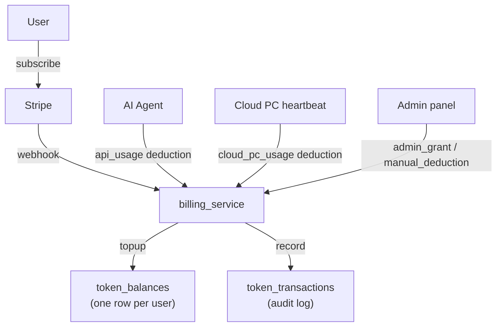
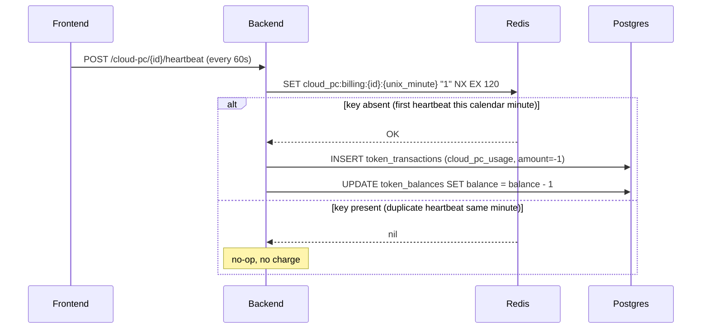

Skygen uses a **token** system layered on top of Stripe subscriptions. Every AI API call and every minute of Cloud PC runtime deducts tokens from the user's balance. Plans define how many tokens are included per billing period, which agent modes are available, and which model profile the agent uses.

## Architecture



## Token balance

Source: `Backend/app/models/billing.py` — `TokenBalance`

One row per user. Updated atomically on every debit or credit.

| Column | Type | Description |
|--------|------|-------------|
| `balance` | `Integer` | Current balance in tokens |
| `fractional_tokens` | `Float` | Accumulated sub-token fractions not yet deducted (avoids rounding loss on small API calls) |
| `total_earned` | `Integer` | Lifetime tokens credited |
| `total_spent` | `Integer` | Lifetime tokens debited |

**Token unit:** 1 token ≈ 1 cent USD (exact exchange rate set by the plan's `margin_multiplier`). All API costs are converted from USD to tokens at charge time.

## Transaction types

`TransactionType` enum (source: `Backend/app/models/billing.py`):

| Type | Direction | Description |
|------|-----------|-------------|
| `api_usage` | Debit | Tokens spent on LLM API calls |
| `cloud_pc_usage` | Debit | 1 token per minute of Cloud PC runtime |
| `manual_deduction` | Debit | Admin-initiated deduction |
| `subscription_topup` | Credit | Monthly token refill when subscription renews |
| `admin_grant` | Credit | Manual grant by admin |
| `free_grant` | Credit | Periodic free-plan token allocation |
| `promo_code` | Credit | Promotional token grant |
| `refund` | Credit | Refunded tokens |
| `trial_grant` | Credit | Legacy trial grant (historical data only) |

## Subscription tiers

`SubscriptionTier` enum:

| Tier | Value | Description |
|------|-------|-------------|
| `NONE` | `none` | No subscription; access blocked |
| `FREE` | `free` | Freemium plan; no card required; limited daily USD spend |
| `STANDARD` | `standard` | Paid subscription via Stripe; monthly token allocation |
| `TRIAL` | `trial` | Legacy; migrated to `FREE` as of migration `20260318_remove_trial` |

## Subscription plans

`SubscriptionPlan` rows are admin-managed and linked to Stripe Price IDs. Named plans in production are typically **Lite**, **Optima**, and **Pro** (or **Free** for the freemium tier).

| Column | Type | Description |
|--------|------|-------------|
| `name` | `String(100)` | Display name (e.g. "Optima") |
| `plan_type` | `String(20)` | `"free"` or `"paid"` |
| `price_usd` | `Float` | Monthly price in USD |
| `monthly_tokens` | `Integer` | Tokens included per billing period |
| `billing_period_days` | `Integer` | Period length (default 30 days) |
| `daily_usd_limit` | `Float` | Daily USD spend cap for free plans |
| `limit_renewal_period_days` | `Integer` | Days between free-plan limit resets |
| `allowed_agent_modes` | `JSON` | `["auto", "cua", "llm"]` — `null` means all modes |
| `model_profile` | `String(50)` | Agent model tier (`"fast"`, `"default"`, `"pro"`) |
| `allowed_model_profiles` | `JSON` | Profiles the user can choose; `null` = no choice |
| `features_config` | `JSON` | Platform feature gates (e.g. `{"cloud_pc": true, "max_cloud_pcs": 3}`) |
| `upgrade_target_plan_id` | FK → self | Plan to suggest for upsells |
| `model_display_name` | `String(100)` | User-facing model label (e.g. "Skygen Pro") |
| `custom_system_prompt` | `Text` | Appended to agent base prompt for all sessions on this plan |

### `features_config` keys

The `features_config` JSON object gates platform features per plan:

| Key | Type | Effect |
|-----|------|--------|
| `cloud_pc` | bool | Enables/disables Cloud PC access |
| `max_cloud_pcs` | int | Maximum Cloud PCs the user can own |
| `max_concurrent_active_cpcs` | int | Maximum simultaneously running Cloud PCs |
| `scheduled_tasks` | bool | Enables scheduled task creation |

## API reference

### Billing status

<ParamField path="GET /billing/status" type="endpoint">
Returns the current user's complete billing status. Used by the frontend to gate features and show upgrade prompts.

**Response `200`:**
```json
{
  "can_access": true,
  "access_reason": "subscription_active",
  "access_message": null,
  "access_action": null,
  "has_payment_method": true,
  "tier": "standard",
  "status": "active",
  "balance": 4200,
  "total_spent": 18500,
  "current_period_end": "2026-06-01T00:00:00",
  "cancel_at_period_end": false,
  "plan_id": "plan-uuid",
  "plan_name": "Optima",
  "plan_price_usd": 29.0,
  "monthly_tokens_included": 5000,
  "plan_type": "paid",
  "daily_usd_limit": null,
  "model_display_name": "Skygen Default",
  "cloud_pc_enabled": true,
  "max_cloud_pcs": 1,
  "hide_token_balance": false,
  "scheduled_tasks_enabled": true,
  "allowed_model_profiles": ["fast", "default"],
  "active_model_profile": "default",
  "model_profiles_meta": [
    { "key": "fast", "display_name": "Skygen Fast", "badge": null },
    { "key": "default", "display_name": "Skygen Default", "badge": null }
  ]
}
```

`can_access` is `false` when:
- `tier == "none"` (no subscription)
- `status` is `past_due`, `incomplete`, or `expired`
- Free plan daily limit exceeded
- Token balance is zero and overage is disabled
</ParamField>

### Token balance

<ParamField path="GET /billing/balance" type="endpoint">
Lightweight balance check.

**Response `200`:**
```json
{
  "balance": 4200,
  "total_spent": 18500
}
```
</ParamField>

### Transaction history

<ParamField path="GET /billing/transactions" type="endpoint">
Returns transactions grouped by chat session.

**Response `200`:**
```json
{
  "session_groups": [
    {
      "session_id": "session-uuid",
      "session_title": "Book a flight to Tokyo",
      "total_tokens": 87,
      "transaction_count": 3,
      "first_activity": "2026-05-08T09:00:00",
      "last_activity": "2026-05-08T09:15:00",
      "transactions": [
        {
          "id": "txn-uuid",
          "agent_type": "cua",
          "model": "claude-sonnet-4-5",
          "tokens": 42,
          "input_tokens": 1200,
          "output_tokens": 350,
          "created_at": "2026-05-08T09:05:00"
        }
      ]
    }
  ],
  "system_transactions": [],
  "total_tokens_used": 87,
  "total_sessions": 1
}
```

`system_transactions` lists non-session debits (e.g., Cloud PC usage billed outside a session context).
</ParamField>

### Stripe card setup

<ParamField path="POST /billing/setup-card" type="endpoint">
Create a Stripe SetupIntent for adding a payment method.

**Response `200`:**
```json
{
  "client_secret": "seti_..._secret_...",
  "setup_intent_id": "seti_..."
}
```

The frontend uses `client_secret` with Stripe.js `confirmCardSetup` to collect card details client-side. Card data never touches the Skygen backend.
</ParamField>

<ParamField path="POST /billing/confirm-card" type="endpoint">
Confirm that a card was successfully added. Optionally associates a `prompt_event_id` for attribution tracking.

**Request:** `{ "setup_intent_id": "seti_...", "prompt_event_id": "evt-uuid" }`
</ParamField>

### Checkout (web subscriptions)

<ParamField path="POST /billing/checkout" type="endpoint">
Create a Stripe Checkout Session for web-based plan purchase.

**Request:**
```json
{
  "plan_id": "plan-uuid",
  "success_url": "https://app.skygen.ai/billing/success",
  "cancel_url": "https://app.skygen.ai/billing/cancel"
}
```

**Response `200`:**
```json
{
  "checkout_url": "https://checkout.stripe.com/pay/cs_...",
  "session_id": "cs_..."
}
```

Redirect the user to `checkout_url`. After payment, Stripe redirects to `success_url`.
</ParamField>

### Plans

<ParamField path="GET /billing/plans" type="endpoint">
List all active, non-hidden subscription plans ordered by `sort_order`.

**Response `200`:** Array of plan objects including `name`, `price_usd`, `monthly_tokens`, `features`, `badge_text`, `button_text`, `is_featured`.
</ParamField>

### Model profile selection

<ParamField path="POST /billing/model-profile" type="endpoint">
Set the user's preferred model profile (e.g., `"fast"`, `"default"`, `"pro"`). The profile must be in the user's `allowed_model_profiles` list. Returns `403` if the plan does not permit the requested profile.

**Request:** `{ "model_profile": "pro" }`
</ParamField>

### Admin endpoints

<ParamField path="POST /billing/admin/grant" type="endpoint">
Grant tokens to a user.

**Request:** `{ "user_id": "uuid", "amount": 1000, "description": "Compensation for outage" }`

Requires admin role.
</ParamField>

<ParamField path="POST /billing/admin/deduct" type="endpoint">
Deduct tokens from a user.

**Request:** `{ "user_id": "uuid", "amount": 500, "description": "Manual adjustment" }`

Requires admin role.
</ParamField>

## Cloud PC billing

Cloud PC runtime is billed at **1 token per minute** through the heartbeat mechanism. The dedup key is a **per-calendar-minute bucket**: `cloud_pc:billing:{cloud_pc_id}:{unix_minute}` where `unix_minute = int(time.time()) // 60`. Written with `SET ... NX EX 120` — if the key already exists for this calendar minute, the heartbeat is accepted but no token is deducted.



The 120-second TTL (2× the bucket width) ensures keys expire cleanly even when a heartbeat arrives slightly after a minute boundary.

If the user's balance reaches zero while a Cloud PC is active, the next heartbeat fails billing validation. The Cloud PC is automatically paused and a `cloud_pc_status_changed` event is sent to the frontend.

## Free plan limits

Free plans use a **daily USD spend cap** rather than a fixed token allocation:

| Field | Typical value | Description |
|-------|--------------|-------------|
| `daily_usd_limit` | `0.50` | Maximum USD equivalent per day |
| `limit_renewal_period_days` | `1` | Reset every day |

When the daily limit is hit, `can_access` becomes `false` with `access_reason = "daily_limit_reached"`. The frontend should show the upgrade prompt.

## Model profiles

`ModelProfileConfig` rows (admin-managed) define the available model tiers:

| Key | Display name | Description |
|-----|-------------|-------------|
| `fast` | Skygen Fast | Lightweight agents for simple everyday tasks |
| `default` | Skygen Default | Balanced model for general automation |
| `pro` | Skygen Pro | Heavy reasoning, long context, complex tasks |

The `model_profile` on a `SubscriptionPlan` maps directly to a `MODEL_PROFILES` key in `Agent/config.py`, which determines which LLM is used for each call type within a session.

## Overage

Paid plans may have `allow_overage = true` on their `Subscription` row. When the included monthly tokens are exhausted:

- If overage is **disabled**: `can_access = false`, `access_reason = "tokens_exhausted"`, `access_action = "enable_overage"`.
- If overage is **enabled**: additional usage is charged via Stripe's metered billing using `stripe_metered_item_id`. Overage is tracked in `overage_tokens_used` on the `Subscription` row.

## Gotchas

<Warning>
**`cloud_pc_usage` charges require a valid subscription.** The Cloud PC connect endpoint checks `can_access` AND requires a minimum of 5 tokens before provisioning. A zero-balance account cannot start a new Cloud PC session even if the subscription is technically active.
</Warning>

<Note>
**`fractional_tokens` prevents rounding loss.** API costs often convert to sub-integer token values. The fractional part is accumulated in `fractional_tokens` and only deducted once the fraction exceeds 1.0. This means a single very cheap call may not immediately decrement the visible `balance`.
</Note>

<Note>
**`hide_token_balance`** is a plan flag that tells the frontend not to show the token balance counter. Used for enterprise accounts with custom billing arrangements.
</Note>

## SQLAlchemy model snippets

Source: `Backend/app/models/billing.py`

```python
class SubscriptionPlan(Base):
    __tablename__ = "subscription_plans"

    id = Column(String(36), primary_key=True, ...)
    name = Column(String(100), nullable=False)          # "Lite", "Pro", "Enterprise"
    plan_type = Column(String(20), nullable=False, default="paid")
    price_usd = Column(Float, nullable=False)
    billing_period_days = Column(Integer, nullable=False, default=30)
    monthly_tokens = Column(Integer, nullable=False)
    is_active = Column(Boolean, default=True, nullable=False)
    is_featured = Column(Boolean, default=False, nullable=False)
    is_hidden = Column(Boolean, default=False, nullable=False)

    # Freemium / plan access fields
    daily_usd_limit = Column(Float, nullable=True)
    limit_renewal_period_days = Column(Integer, nullable=True)

    # Agent mode policy (JSON array)
    allowed_agent_modes = Column(Text, nullable=True)   # null = all modes
    model_profile = Column(String(50), nullable=True)   # "fast" | "default" | "pro"
    allowed_model_profiles = Column(Text, nullable=True)

    # Display customisation
    old_price_usd = Column(Float, nullable=True)        # Crossed-out price
    badge_text = Column(String(255), nullable=True)
    button_text = Column(String(100), nullable=True)
    credits_label = Column(String(100), nullable=True)

    # Feature access JSON
    features_config = Column(Text, nullable=True)       # {"cloud_pc": true, ...}
    custom_system_prompt = Column(Text, nullable=True)
    upgrade_target_plan_id = Column(String(36), ForeignKey("subscription_plans.id"), ...)
```

```python
class TokenBalance(Base):
    __tablename__ = "token_balances"

    id = Column(String(36), primary_key=True, ...)
    user_id = Column(String(36), ForeignKey("users.id", ondelete="CASCADE"), unique=True)
    balance = Column(Integer, nullable=False, default=0)
    fractional_tokens = Column(Float, nullable=False, default=0.0)
    total_earned = Column(Integer, nullable=False, default=0)
    total_spent = Column(Integer, nullable=False, default=0)
```

## Querying billing status

<CodeGroup>

```bash cURL
# Full billing status
curl https://api.skygen.ai/billing/status \
  -H "Authorization: Bearer $TOKEN"

# Token balance only
curl https://api.skygen.ai/billing/balance \
  -H "Authorization: Bearer $TOKEN"

# Transaction history (last 50)
curl "https://api.skygen.ai/billing/transactions?limit=50&offset=0" \
  -H "Authorization: Bearer $TOKEN"
```

```javascript JavaScript
// Full billing status (includes can_access, allowed_modes, balance)
const billing = await fetch('/billing/status', {
  headers: { Authorization: `Bearer ${token}` },
}).then(r => r.json());

// Check if user can proceed before sending a message
if (!billing.can_access) {
  showUpgradePrompt(billing.access_action);
}

// Filter mode picker to allowed modes
const allowed = billing.allowed_agent_modes ?? null; // null = all allowed
```

```python Python
import httpx

async def get_billing_status(token: str) -> dict:
    async with httpx.AsyncClient() as c:
        return (await c.get(
            "https://api.skygen.ai/billing/status",
            headers={"Authorization": f"Bearer {token}"},
        )).json()
```

</CodeGroup>

## Transaction type reference

```python
class TransactionType(str, PyEnum):
    # Credits
    TRIAL_GRANT = "trial_grant"        # Legacy — historical data only
    SUBSCRIPTION_TOPUP = "subscription_topup"  # Monthly renewal
    ADMIN_GRANT = "admin_grant"        # Manual admin credit
    PROMO_CODE = "promo_code"          # Promotional grant
    REFUND = "refund"                  # Refund
    FREE_GRANT = "free_grant"          # Periodic free-plan allocation

    # Debits
    API_USAGE = "api_usage"            # LLM API cost
    CLOUD_PC_USAGE = "cloud_pc_usage"  # 1 token/min Cloud PC
    MANUAL_DEDUCTION = "manual_deduction"  # Admin deduction
```

The `amount` field on `TokenTransaction` is **always positive**. The `transaction_type` determines whether it is a credit or debit. The `balance_after` field records the balance at the time of the transaction, enabling full point-in-time reconstruction.

## See also

- [Cloud PC](/concepts/cloud-pc) — heartbeat billing and the minimum-balance gate
- [Agents](/concepts/agents) — model routing by profile (premium / balanced / economy)
- [Agent modes](/concepts/agent-modes) — which modes are available per plan
