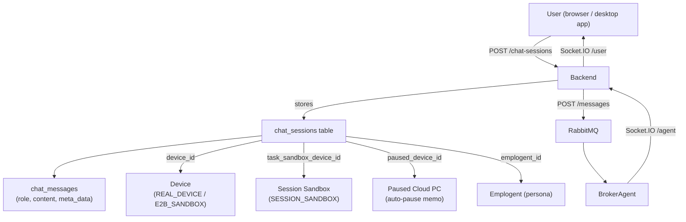
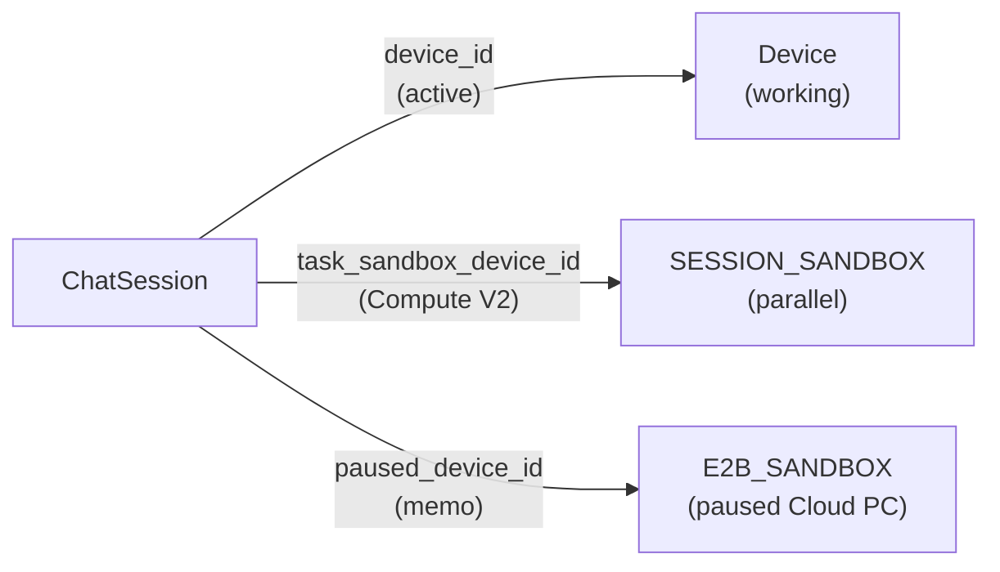
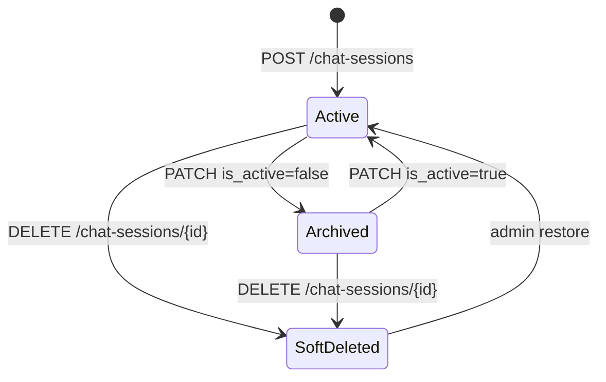
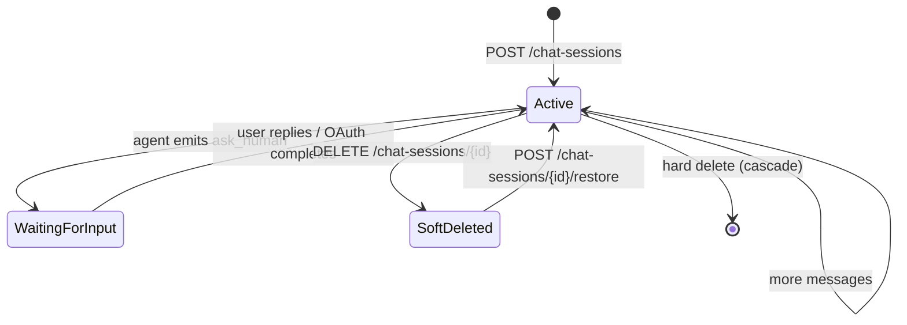

A **chat session** is the persistent container for a conversation between a user and the Skygen agent. It holds the message history, binds to a device, and carries the `waiting_for_input` flag that governs whether the composer accepts new messages or shows a confirmation widget.

## Architecture



## Data model

Source: `Backend/app/models/chat_sessions.py`

| Column | Type | Description |
|--------|------|-------------|
| `id` | `String(36)` UUID | Primary key |
| `title` | `String` | Display title (max 200 characters) |
| `is_active` | `Boolean` | `false` when the session is archived by the user |
| `meta_data` | `JSON` | Freeform dict; `waiting_for_input` lives here as a derived flag |
| `device_id` | FK → `devices` | Primary active device; `ON DELETE SET NULL` |
| `task_sandbox_device_id` | FK → `devices` | Compute V2 session sandbox; `ON DELETE SET NULL` |
| `paused_device_id` | FK → `devices` | Auto-pause memo for Cloud PC resume; `ON DELETE SET NULL` |
| `emplogent_id` | FK → `emplogents` | Optional persona injected into agent payload |
| `user_id` | FK → `users` | Owner; `ON DELETE CASCADE` |
| `created_at` | `DateTime` | Creation timestamp |
| `updated_at` | `DateTime` | Last update (auto-updated by SQLAlchemy `onupdate`) |
| `deleted_at` | `DateTime` | Soft-delete timestamp; `null` means not deleted |

### `waiting_for_input`

This flag is a **derived value** stored in `meta_data.waiting_for_input`, not a standalone column. The `ask_human_state` service recomputes it from the actual `chat_messages` rows:

- Scans all `role = "assistant"` messages in the session.
- Sets `waiting_for_input = true` if any message has `meta_data.type == "ask_human"` AND `meta_data.ask_human_action == "request"`.
- Broadcasts `session_updated` via Socket.IO only when the value changes.

**Never flip `meta_data.waiting_for_input` directly.** Always go through `mark_ask_human_pending` / `mark_ask_human_resolved` in `app/services/ask_human_state.py`.

### `ChatSessionRead` schema

```json
{
  "id": "session-uuid",
  "user_id": "user-uuid",
  "device_id": "device-uuid",
  "emplogent_id": null,
  "title": "Book a flight to Tokyo",
  "is_active": true,
  "meta_data": { "waiting_for_input": false },
  "waiting_for_input": false,
  "created_at": "2026-05-01T10:00:00",
  "updated_at": "2026-05-08T09:30:00"
}
```

`waiting_for_input` at the top level is extracted from `meta_data` by the `@model_validator` in `ChatSessionRead` for convenience.

## API reference

### Create a session

<ParamField path="POST /chat-sessions" type="endpoint">
Create a new chat session. Optionally bind to a device and/or emplogent at creation time.

**Request body:**

<ParamField body="title" type="string" default="New Chat">
  Display title. Empty or whitespace-only strings are coerced to `"New Chat"`. Maximum 200 characters.
</ParamField>

<ParamField body="device_id" type="string | null">
  Device to bind. Pass empty string to explicitly unbind; the validator converts it to `null`.
</ParamField>

<ParamField body="emplogent_id" type="string | null">
  Emplogent (persona) to bind. The persona's system prompt is injected into the agent payload, not into the message history.
</ParamField>

<ParamField body="meta_data" type="object" default="{}">
  Initial metadata. Do not pass `waiting_for_input` here; it is managed internally.
</ParamField>

**Response `201`:** Returns `ChatSessionRead`.
</ParamField>

### List sessions

<ParamField path="GET /chat-sessions" type="endpoint">
Returns all non-deleted sessions for the current user, most-recently-updated first.

Optional query parameters:

| Param | Type | Description |
|-------|------|-------------|
| `is_active` | bool | Filter by `is_active` flag |
| `device_id` | string | Filter by bound device |
| `limit` | int | Page size (default 50) |
| `offset` | int | Pagination offset |

**Response `200`:** Array of `ChatSessionRead`.
</ParamField>

### Get a session

<ParamField path="GET /chat-sessions/{session_id}" type="endpoint">
Returns a single session. Returns `404` if soft-deleted or owned by a different user.
</ParamField>

### Update a session

<ParamField path="PATCH /chat-sessions/{session_id}" type="endpoint">
Update title, device binding, `is_active` flag, or arbitrary metadata.

**Request body** (`ChatSessionUpdate` schema):

<ParamField body="title" type="string">New title (1–200 characters).</ParamField>
<ParamField body="device_id" type="string | null">New device binding. Empty string coerced to `null`.</ParamField>
<ParamField body="is_active" type="boolean">Archive (`false`) or restore (`true`) the session.</ParamField>
<ParamField body="meta_data" type="object">Merge patch applied to `meta_data`.</ParamField>
</ParamField>

### Delete a session

<ParamField path="DELETE /chat-sessions/{session_id}" type="endpoint">
Soft-delete the session by setting `deleted_at = now()`. Associated messages are NOT deleted. Restore is possible by patching `deleted_at` to `null` via the admin API.
</ParamField>

## Message flow

Sending a message to an active session goes through RabbitMQ and the agent worker:

<Steps>
  <Step title="POST /messages">
    The frontend posts `{ session_id, content, agent_mode }`. The backend validates billing access, inserts a `user` role message, and publishes a job to RabbitMQ.
  </Step>
  <Step title="BrokerAgent picks up the job">
    The BrokerAgent worker dequeues the `AgentProcessingPayload`, acquires session and device locks, and routes to the appropriate specialist agent based on `agent_mode`.
  </Step>
  <Step title="Agent produces a response">
    The specialist agent runs its reasoning loop (up to `max_iter=100` steps), submits device actions, and streams intermediate progress as `TASK_PROGRESS` events to the frontend.
  </Step>
  <Step title="Response is persisted">
    The final `assistant` role message is inserted into `chat_messages`. If the agent raised an `ask_human`, the message has `meta_data.type = "ask_human"` and `meta_data.ask_human_action = "request"`.
  </Step>
  <Step title="Session updated event">
    The backend emits `session_updated` via Socket.IO `/user` namespace with the updated `ChatSessionRead` including the new `waiting_for_input` value.
  </Step>
</Steps>

## Socket.IO events

All session-related events are pushed to the `/user` Socket.IO namespace, keyed by `user_id`.

| Event | Trigger | Payload |
|-------|---------|---------|
| `session_updated` | Any session metadata change (including `waiting_for_input` flip) | `ChatSessionRead` |
| `new_message` | New `chat_messages` row inserted | `{ session_id, message }` |
| `agent_response` | Agent sends final or streaming response | `{ session_id, content, role, meta_data }` |
| `task_progress` | In-flight agent progress (step update, tool call result) | `{ session_id, task_id, step, ... }` |
| `chat_message_meta_updated` | `meta_data` on an existing message changed (e.g., `ask_human_action` flipped to `"answered"`) | `{ session_id, message_id, meta_data }` |

## Device bindings

### Three FK slots



- **`device_id`** — the primary device the agent sends actions to. Changes when the user connects a different device or a Cloud PC.
- **`task_sandbox_device_id`** — Compute V2 slot: a `SESSION_SANDBOX` device that runs alongside the primary device within the same session (e.g., an isolated environment for a specific sub-task).
- **`paused_device_id`** — written only on Cloud PC auto-pause (`reason='paused'`). The backend moves `device_id → paused_device_id` to unbind the session without losing the reference. On resume, `paused_device_id → device_id`.

### Compound index

```sql
CREATE INDEX ix_chat_sessions_user_device_active
  ON chat_sessions (user_id, device_id, is_active, deleted_at);
```

Used for the common query pattern: "list active sessions for this user on this device".

## Session lifecycle



The `is_active` flag is user-controlled archiving. `deleted_at` is a soft-delete for recovery. Neither cascades to `chat_messages`.

## Composite index and query patterns

The backend retrieves sessions with patterns such as:

```python
# All active, non-deleted sessions for a user on a specific device
SELECT * FROM chat_sessions
WHERE user_id = :user_id
  AND device_id = :device_id
  AND is_active = true
  AND deleted_at IS NULL
ORDER BY updated_at DESC;
```

The compound index `ix_chat_sessions_user_device_active` covers this query.

## Gotchas

<Warning>
**Do not set `meta_data.waiting_for_input` directly.** The field is managed by `app/services/ask_human_state.py`. Writing it directly bypasses the Socket.IO broadcast and will leave the frontend in a stale state. Call `mark_ask_human_pending` / `mark_ask_human_resolved` instead.
</Warning>

<Note>
**`emplogent_id` affects agent payload, not message history.** When an emplogent is bound, its system prompt is injected into the `AgentProcessingPayload` sent to the BrokerAgent — it does not appear as a message row. Changing the emplogent mid-session takes effect on the next message.
</Note>

<Note>
**Soft-delete does not cascade.** Deleting a session does NOT delete its messages. They remain in `chat_messages` with their `session_id` FK intact. This is intentional for audit and billing history.
</Note>

## Creating a session (full example)

<Steps>
  <Step title="Create the session">
    ```bash
    curl -X POST https://api.skygen.ai/chat-sessions \
      -H "Authorization: Bearer <token>" \
      -H "Content-Type: application/json" \
      -d '{
        "title": "Book a flight to Tokyo",
        "device_id": "device-uuid"
      }'
    ```
    Returns `ChatSessionRead` with `id`, `waiting_for_input: false`, and the device binding.
  </Step>
  <Step title="Send a message">
    ```bash
    curl -X POST https://api.skygen.ai/messages \
      -H "Authorization: Bearer <token>" \
      -H "Content-Type: application/json" \
      -d '{
        "session_id": "session-uuid",
        "content": "Find the cheapest flight to Tokyo on May 20",
        "agent_mode": "auto"
      }'
    ```
    The message is published to RabbitMQ. The agent picks it up asynchronously.
  </Step>
  <Step title="Stream progress">
    Connect to Socket.IO `/user` namespace and listen for:
    - `task_progress` — step-by-step action log
    - `agent_response` — final answer
    - `session_updated` — if `waiting_for_input` changes
  </Step>
  <Step title="Handle confirmations">
    If `session_updated.waiting_for_input == true`, show the confirmation UI.
    The user's reply is another `POST /messages` call to the same session.
  </Step>
</Steps>

## Message schema

Source: `Backend/app/models/chat_messages.py`

| Column | Type | Description |
|--------|------|-------------|
| `id` | `String(36)` UUID | Primary key |
| `session_id` | FK → `chat_sessions` | Parent session |
| `role` | `String` | `"user"` \| `"assistant"` \| `"system"` |
| `content` | `Text` | Message text |
| `meta_data` | `JSON` | Structured metadata (see below) |
| `task_id` | FK → `tasks` | Associated task (optional) |
| `created_at` | `DateTime` | Timestamp |

### `meta_data` structure

| Key | Present when | Value |
|-----|-------------|-------|
| `type` | Agent confirmation | `"ask_human"` |
| `ask_human_action` | `type == "ask_human"` | `"request"` or `"answered"` |
| `ui_meta` | Agent step output | `{ step_type, input, ... }` |
| `status` | Terminal message | `"completed"` \| `"error"` \| etc. |
| `final_outcome` | Terminal message | `"DONE"` \| `"FAIL"` \| `"CANCELLED"` |
| `agent_mode` | Any agent message | The mode used for this turn |
| `safety_violation` | Safety block | `true` |

## Pagination

The default `GET /chat-sessions` response is most-recently-updated-first. For large histories:

```bash
# Page 2, 20 sessions per page
GET /chat-sessions?limit=20&offset=20
```

Messages within a session are paginated via `GET /messages?session_id=...&limit=50&before=<message_id>`.

## Emplogent binding

An **emplogent** is a custom persona that shapes agent behaviour (system prompt, tone, constraints). When `emplogent_id` is set on a session:

- The emplogent's system prompt is appended to the agent's base system prompt.
- The emplogent's name and avatar may appear in the UI.
- Changing `emplogent_id` mid-session via `PATCH /chat-sessions/{id}` takes effect on the **next** message — existing messages in the history are not re-processed.

## SQLAlchemy model

Source: `Backend/app/models/chat_sessions.py`

```python
class ChatSession(Base):
    __tablename__ = "chat_sessions"

    id = Column(String(36), primary_key=True, default=gen_uuid_str, index=True)
    title = Column(String, nullable=False)
    is_active = Column(Boolean, default=True, nullable=False)
    meta_data = Column(JSON, default=dict)
    deleted_at = Column(DateTime, nullable=True)   # soft delete

    user_id = Column(String(36), ForeignKey("users.id", ondelete="CASCADE"), ...)
    device_id = Column(String(36), ForeignKey("devices.id", ondelete="SET NULL"), ...)

    # Parallel SESSION_SANDBOX slot (Compute V2)
    task_sandbox_device_id = Column(
        String(36), ForeignKey("devices.id", ondelete="SET NULL"), nullable=True
    )

    # One-shot memo for Cloud PC auto-pause
    paused_device_id = Column(
        String(36), ForeignKey("devices.id", ondelete="SET NULL"), nullable=True
    )

    emplogent_id = Column(String(36), ForeignKey("emplogents.id", ondelete="SET NULL"), ...)

    __table_args__ = (
        Index(
            "ix_chat_sessions_user_device_active",
            "user_id", "device_id", "is_active", "deleted_at",
        ),
    )
```

## Creating and managing sessions via API

<CodeGroup>

```bash cURL
# Create a session
curl -X POST https://api.skygen.ai/chat-sessions \
  -H "Authorization: Bearer $TOKEN" \
  -H "Content-Type: application/json" \
  -d '{"title": "Quarterly report research", "device_id": "device-uuid"}'

# List sessions
curl https://api.skygen.ai/chat-sessions?limit=20&offset=0 \
  -H "Authorization: Bearer $TOKEN"

# Rename a session
curl -X PATCH https://api.skygen.ai/chat-sessions/session-uuid \
  -H "Authorization: Bearer $TOKEN" \
  -H "Content-Type: application/json" \
  -d '{"title": "Q2 2026 Research"}'

# Delete a session (soft delete)
curl -X DELETE https://api.skygen.ai/chat-sessions/session-uuid \
  -H "Authorization: Bearer $TOKEN"
```

```javascript JavaScript
// Create a session
const session = await fetch('/chat-sessions', {
  method: 'POST',
  headers: { Authorization: `Bearer ${token}`, 'Content-Type': 'application/json' },
  body: JSON.stringify({ title: 'Quarterly report research', device_id: deviceId }),
}).then(r => r.json());

// List sessions
const sessions = await fetch('/chat-sessions?limit=20').then(r => r.json());

// Update title
await fetch(`/chat-sessions/${session.id}`, {
  method: 'PATCH',
  headers: { Authorization: `Bearer ${token}`, 'Content-Type': 'application/json' },
  body: JSON.stringify({ title: 'Q2 2026 Research' }),
});
```

```python Python
import httpx

client = httpx.AsyncClient(headers={"Authorization": f"Bearer {token}"})

# Create
session = (await client.post("/chat-sessions",
    json={"title": "Research", "device_id": device_id})).json()

# List
sessions = (await client.get("/chat-sessions", params={"limit": 20})).json()

# Patch
await client.patch(f"/chat-sessions/{session['id']}",
    json={"title": "Q2 2026 Research"})
```

</CodeGroup>

## Session lifecycle

A session is active (`is_active = true`) while the device is connected and no terminal event has occurred. Common transitions:



Sessions are never hard-deleted by the user — only by admin cleanup jobs or explicit cascade when the owning user is deleted.

## Fetching messages in a session

Messages are retrieved separately via the messages endpoint:

```bash
# Most recent 50 messages in a session
GET /messages?session_id=session-uuid&limit=50

# Cursor-based pagination (older messages)
GET /messages?session_id=session-uuid&limit=50&before=message-uuid
```

Each message has `role` (`user` | `assistant` | `system`), `content` (string), optional `task_id` FK, and `meta_data` JSON.

## See also

- [Confirmations](/concepts/confirmations) — how `waiting_for_input` is set and cleared
- [Devices](/concepts/devices) — the three device FK slots in detail
- [Agents](/concepts/agents) — how the BrokerAgent processes messages for a session
- [Tasks](/concepts/tasks) — the task rows created per agent run
- [Notifications](/concepts/notifications) — the Socket.IO events that update the UI in real time
