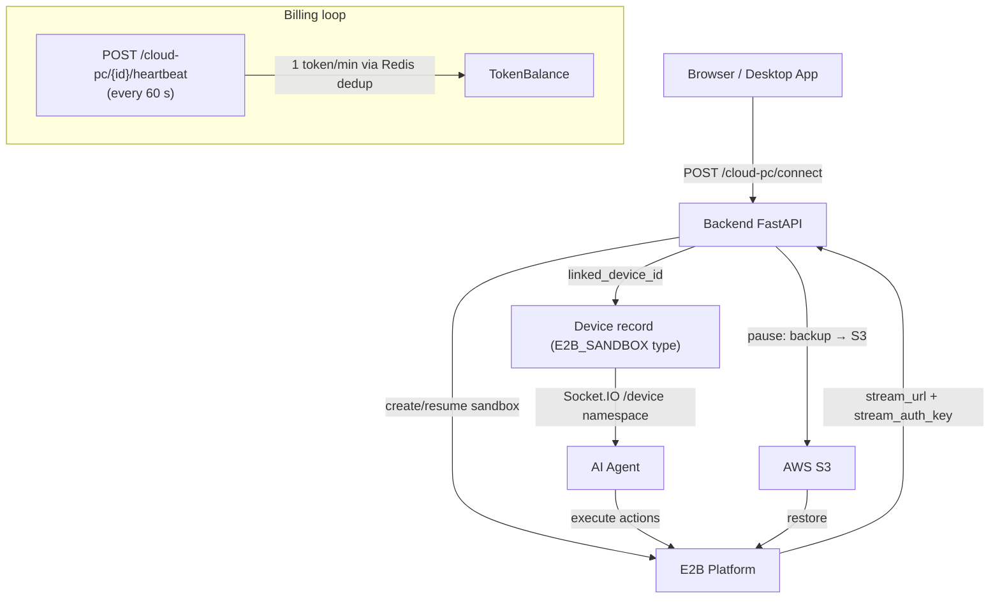
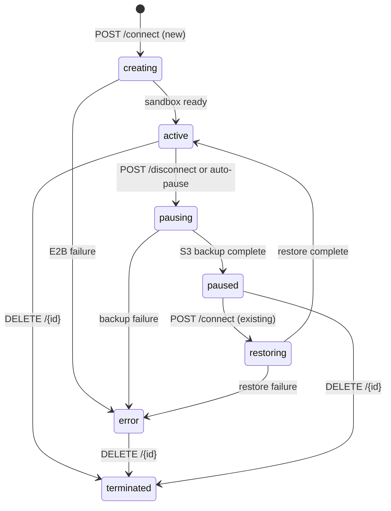
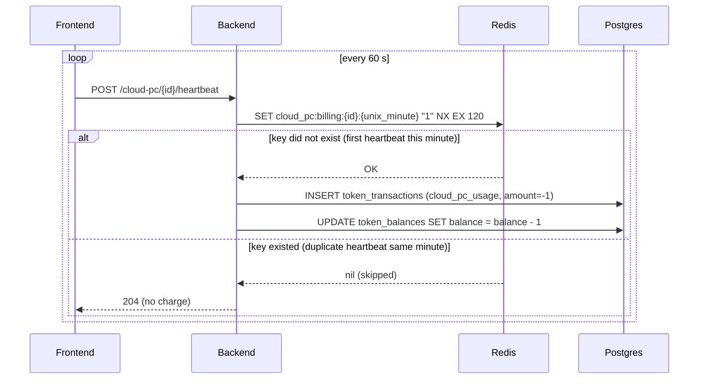

A **Cloud PC** is a persistent virtual desktop provisioned on-demand via the E2B sandbox infrastructure. Unlike a per-session sandbox that is torn down when the session ends, a Cloud PC survives between sessions: its filesystem is serialised to S3 on pause and restored on resume. The user and the AI agent share a single screen through a noVNC-style stream, with an exclusive control lock that prevents them from acting simultaneously.

## Architecture



**Key tables:**

| Table | Purpose |
|-------|---------|
| `cloud_pcs` | One row per persistent desktop; tracks status, stream URL, backup location |
| `devices` | One linked `E2B_SANDBOX` device row; bridges Cloud PC to Socket.IO agent path |
| `token_transactions` | Every `cloud_pc_usage` debit |

## Lifecycle states

`CloudPCStatus` (source: `Backend/app/models/cloud_pc.py`):

| Status | Meaning |
|--------|---------|
| `creating` | E2B sandbox is being provisioned for the first time |
| `restoring` | Filesystem backup is being loaded from S3 |
| `active` | Sandbox is live; stream URL is valid |
| `pausing` | Backup is being written to S3, sandbox will be paused |
| `paused` | Sandbox is suspended; filesystem is in S3 |
| `resuming` | Backup is being restored; sandbox is starting up |
| `error` | A lifecycle operation failed; check `status` field and retry |
| `terminated` | Sandbox permanently destroyed; cannot resume |



## API reference

### Connect / resume

<ParamField path="POST /cloud-pc/connect" type="endpoint">
Provision a new Cloud PC or attach an existing one to a chat session.

Rate-limited to **10 requests per 60 seconds** per user. Requires billing access and a minimum of **5 tokens** in the account. Enforces a 1:1 session binding — a Cloud PC can only be attached to one session at a time.

**Request body:**

<ParamField body="cloud_pc_id" type="string | null">
  UUID of an existing Cloud PC to resume. Omit to create a new one.
</ParamField>

<ParamField body="name" type="string | null">
  Display name for a new Cloud PC (max 100 characters).
</ParamField>

<ParamField body="session_id" type="string | null">
  Chat session to bind this Cloud PC to.
</ParamField>

<ParamField body="force_reattach" type="boolean" default="false">
  Pass `true` to steal the Cloud PC from another session after the user confirms the Force Release dialog.
</ParamField>

**Response `200`:**
```json
{
  "status": "active",
  "cloud_pc_id": "3fa85f64-5717-4562-b3fc-2c963f66afa6",
  "sandbox_id": "snd_01J...",
  "stream_url": "wss://stream.e2b.dev/...",
  "stream_auth_key": "eak_...",
  "resolution": [1920, 1080],
  "message": "Cloud PC is ready"
}
```

**Error responses:**

| Code | `error` field | Meaning |
|------|--------------|---------|
| `402` | `billing_required` | No payment method on file |
| `402` | `tokens_exhausted` | Monthly tokens used up; enable pay-as-you-go |
| `409` | `cloud_pc_busy` | This Cloud PC is already bound to another session; use `force_reattach` |
| `503` | — | E2B service unavailable or feature disabled |
</ParamField>

### Disconnect / pause

<ParamField path="POST /cloud-pc/disconnect" type="endpoint">
Back up the sandbox filesystem to S3 and suspend it. Status transitions to `pausing → paused`.

**Request body:**

<ParamField body="cloud_pc_id" type="string | null">
  UUID of the Cloud PC to pause. Resolves from the session's `device_id` when omitted.
</ParamField>

<ParamField body="session_id" type="string | null">
  When provided, clears `chat_sessions.device_id` so the session no longer owns the Cloud PC.
</ParamField>

**Response `200`:**
```json
{
  "status": "paused",
  "message": "Cloud PC paused and backed up",
  "backed_up": true
}
```
</ParamField>

### List

<ParamField path="GET /cloud-pc/list" type="endpoint">
Returns all Cloud PCs owned by the current user plus plan limits.

**Response `200`:**
```json
{
  "cloud_pcs": [
    {
      "cloud_pc_id": "3fa85f64-...",
      "name": "My Desktop",
      "status": "active",
      "sandbox_id": "snd_01J...",
      "stream_url": "wss://...",
      "created_at": "2026-01-15T12:00:00",
      "last_activity_at": "2026-05-08T09:30:00",
      "linked_device_id": "device-uuid",
      "is_agent_active": true,
      "backup_size_bytes": 4831838208,
      "last_backup_at": "2026-05-07T22:00:00",
      "deleted_at": null
    }
  ],
  "max_cloud_pcs": 1,
  "max_concurrent_active_cpcs": 1
}
```

`max_concurrent_active_cpcs` — maximum number of simultaneously running (non-paused) Cloud PCs allowed by the plan. Independent of `max_cloud_pcs`, which counts paused ones too.
</ParamField>

### Status

<ParamField path="GET /cloud-pc/status" type="endpoint">
Current status and connection details for the user's primary Cloud PC.

**Response `200`:**
```json
{
  "status": "active",
  "cloud_pc_id": "3fa85f64-...",
  "name": "My Desktop",
  "sandbox_id": "snd_01J...",
  "stream_url": "wss://...",
  "last_backup_at": "2026-05-07T22:00:00",
  "backup_size_bytes": 4831838208,
  "paused_at": null,
  "last_activity_at": "2026-05-08T09:30:00",
  "total_active_seconds": 7200,
  "linked_device_id": "device-uuid",
  "controller": "ai"
}
```

`controller` — `"ai"` when the agent holds the control lock, `"user"` when the user does, `null` when nobody does.
</ParamField>

### Heartbeat

<ParamField path="POST /cloud-pc/{id}/heartbeat" type="endpoint">
Proof-of-life ping sent by the frontend every **60 seconds** while the Cloud PC stream is open. Deduped via Redis — only the first call in any 60-second window deducts tokens.

**Request body:**

<ParamField body="is_active" type="boolean" default="false">
  `true` if the user had at least one real interaction (mouse/keyboard) since the last heartbeat. Updates `last_interaction_at` in addition to `last_activity_at`.
</ParamField>

**Billing:** Each accepted heartbeat deducts **1 token** via a `cloud_pc_usage` transaction.
</ParamField>

### Take control / Resume AI

<ParamField path="POST /cloud-pc/take-control" type="endpoint">
User claims the control lock, interrupting any active AI action.

**Request body:** `{ "session_id": "uuid" }`

**Response `200`:**
```json
{ "status": "ok", "controller": "user" }
```
</ParamField>

<ParamField path="POST /cloud-pc/resume-ai" type="endpoint">
User releases the control lock back to the AI.

**Request body:** `{ "session_id": "uuid" }`

**Response `200`:**
```json
{ "status": "ok", "controller": "ai", "queued_messages_count": 2 }
```

`queued_messages_count` — messages that arrived while the user held control and are now unblocked for processing.
</ParamField>

### File management

All file operations are scoped to `/home/user/` on the sandbox. Paths containing null bytes or traversal sequences are rejected at the schema layer.

<ParamField path="GET /cloud-pc/{id}/files" type="endpoint">
List directory contents. Query param: `path` (default `/home/user`).

**Response entry shape:**
```json
{
  "name": "report.pdf",
  "type": "file",
  "size": 204800,
  "modified_at": 1746704400,
  "permissions": "-rw-r--r--"
}
```
</ParamField>

<ParamField path="POST /cloud-pc/{id}/files/download" type="endpoint">
Generate a presigned S3 download URL for a file.

**Request:** `{ "file_path": "/home/user/report.pdf" }`

**Response:**
```json
{
  "download_url": "https://s3.amazonaws.com/...",
  "filename": "report.pdf",
  "size": 204800,
  "expires_at": "2026-05-08T10:00:00Z"
}
```
</ParamField>

<ParamField path="POST /cloud-pc/{id}/files/upload" type="endpoint">
Get a presigned S3 upload URL (multipart POST). Upload directly from the browser — the backend is not in the data path.

**Request:** `{ "dest_path": "/home/user/", "filename": "data.csv" }`

**Response:**
```json
{
  "upload_url": "https://s3.amazonaws.com/bucket",
  "fields": { "key": "uploads/...", "Content-Type": "text/csv", "..." : "..." },
  "s3_key": "uploads/user-id/data.csv"
}
```

After the browser completes the upload, call `POST /cloud-pc/{id}/files/upload/callback` with `{ "s3_key": "...", "dest_path": "..." }` to copy the file into the sandbox.
</ParamField>

<ParamField path="POST /cloud-pc/{id}/files/mkdir" type="endpoint">
Create a directory inside the sandbox.

**Request:** `{ "path": "/home/user/projects/new-folder" }`
</ParamField>

### Device linking

<ParamField path="POST /cloud-pc/link-device" type="endpoint">
Create or retrieve the `E2B_SANDBOX` device record that bridges the Cloud PC to the Socket.IO agent path.

**Request:** `{ "cloud_pc_id": "uuid" }`

**Response:**
```json
{
  "device_id": "device-uuid",
  "device_name": "Cloud PC · My Desktop"
}
```

This device ID is what agents use to route actions to the Cloud PC via the `/device` Socket.IO namespace.
</ParamField>

### Update and delete

<ParamField path="PATCH /cloud-pc/{id}" type="endpoint">
Rename a Cloud PC. Body: `{ "name": "New Name" }` (max 100 characters).
</ParamField>

<ParamField path="DELETE /cloud-pc/{id}" type="endpoint">
Soft-delete and permanently destroy the E2B sandbox. The record's `deleted_at` is set; S3 backup is not automatically deleted. Status transitions to `terminated`. This operation is irreversible.
</ParamField>

<ParamField path="POST /cloud-pc/{id}/restore" type="endpoint">
Restore a soft-deleted Cloud PC from its S3 backup. Creates a new sandbox and transitions through `restoring → active`.
</ParamField>

## Billing

Cloud PC time is billed in **1-token-per-minute** increments charged through the heartbeat endpoint. The dedup key uses a **per-calendar-minute bucket** in Redis: `cloud_pc:billing:{cloud_pc_id}:{unix_minute}` where `unix_minute = int(time.time()) // 60`. The key is written with `SET ... NX EX 120` — if the key already exists for this minute, billing is skipped. The 120-second TTL (2 × the bucket width) ensures keys expire cleanly even if a heartbeat arrives slightly after the minute boundary.



Requirements to start a Cloud PC:
- Active subscription with Cloud PC enabled (`features_config.cloud_pc = true`)
- At least **5 tokens** in balance (gate at connect time)
- `max_cloud_pcs` not exceeded for the plan

## Control lock

Only one controller — `"ai"` or `"user"` — may act on the Cloud PC screen at a time.

| Endpoint | Result |
|----------|--------|
| `POST /cloud-pc/take-control` | Sets controller to `"user"`. Agent actions return error until released. |
| `POST /cloud-pc/resume-ai` | Returns controller to `"ai"`. Queued messages are unblocked. |

The agent renews the lock on every action call. If the lock expires (no action within the TTL) and the user takes control, the agent's next action will fail with `"currently controlled by user"`.

## Socket.IO events

When the Cloud PC status or controller changes, the backend pushes an event to the connected frontend via the `/user` Socket.IO namespace.

| Event name | Trigger | Key payload fields |
|------------|---------|-------------------|
| `cloud_pc_status_changed` | Any `CloudPCStatus` transition | `cloud_pc_id`, `status`, `stream_url` |
| `cloud_pc_control_changed` | Take-control or resume-AI | `cloud_pc_id`, `controller` (`"ai"` \| `"user"`) |

## Persistence and backup

On `POST /disconnect` the backend:

1. Calls the E2B SDK to snapshot the sandbox filesystem.
2. Uploads the snapshot to S3 at key `backups/{user_id}/{cloud_pc_id}/{timestamp}.tar.gz`.
3. Writes `backup_s3_key`, `backup_size_bytes`, and `last_backup_at` on the `cloud_pcs` row.
4. Transitions status to `paused`.

On `POST /connect` for an existing Cloud PC in `paused` state:

1. Status transitions to `restoring`.
2. E2B restores from the S3 key stored in `backup_s3_key`.
3. Status transitions to `active` and a new `stream_url` is issued.

## Auto-pause memo

When the agent auto-pauses a Cloud PC session, the backend moves `chat_sessions.device_id` to `chat_sessions.paused_device_id` rather than clearing it. This one-shot memo lets the session be resumed later by restoring `device_id` from `paused_device_id`. Only the `reason='paused'` path writes this field; `reason='terminate'` and `reason='sandbox_missing'` remain destructive.

## Gotchas

<Warning>
**Stream URL expires.** The `stream_url` is valid only for the current active session. After a pause/resume cycle a new URL is issued. Always re-fetch via `GET /cloud-pc/status` before connecting a noVNC client.
</Warning>

<Warning>
**File paths must be under `/home/user/`.** The schema validator normalises the path with `os.path.normpath` and rejects anything outside `/home/user` — including traversal sequences (`../`). Absolute paths that do not start with `/home/user` are rejected with `422`.
</Warning>

<Note>
**`is_agent_active` in list response.** This field is `true` when an agent task is currently running against this Cloud PC. Use it to warn the user before taking control.
</Note>

<Note>
**Soft-delete vs. terminate.** `DELETE /{id}` sets `deleted_at` (soft delete) and kills the E2B sandbox, but the S3 backup survives. `POST /{id}/restore` can recover from the backup. Hard-purging the S3 key is a separate admin operation.
</Note>

## See also

- [Devices](/concepts/devices) — how the `E2B_SANDBOX` device type bridges Cloud PC to the agent action layer
- [Billing](/concepts/billing) — token system, subscription tiers, and Cloud PC quotas
- [Agents](/concepts/agents) — how agents route actions to Cloud PC via the device layer
- [Confirmations](/concepts/confirmations) — the `start_cloud_pc_prompt` confirmation type that gates the first connect
