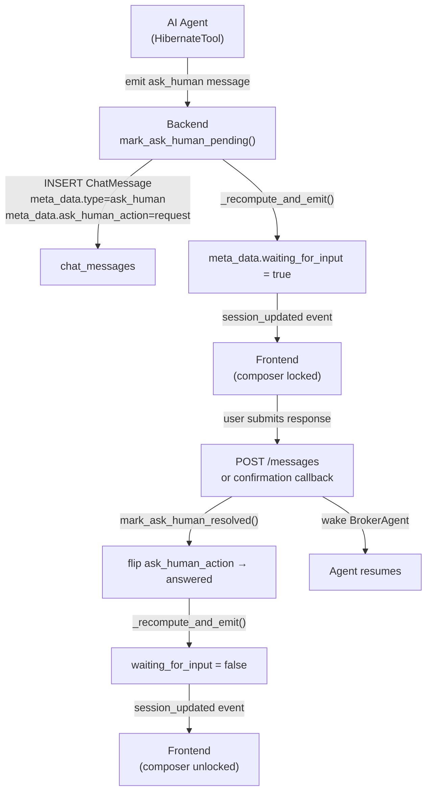
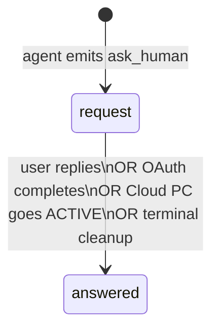

A **confirmation** is a structured pause in the agent's execution loop. When the agent needs something from the user — a text answer, a decision, a third-party OAuth consent, or permission to start a Cloud PC — it emits an `ask_human` ChatMessage and hibernates. The session's `waiting_for_input` flag is set to `true`, locking the composer into confirmation mode until the user responds.

## Architecture



## The `ask_human` message

Confirmations are ordinary `ChatMessage` rows with role `"assistant"` and a structured `meta_data` payload. They are NOT a separate table.

Source: `Backend/app/models/chat_messages.py` + `Backend/app/services/ask_human_state.py`

### `meta_data` shape

```json
{
  "type": "ask_human",
  "ask_human_action": "request",
  "ui_meta": {
    "input": {
      "type": "<confirmation_type>",
      ...type-specific fields...
    }
  }
}
```

| Field | Values | Description |
|-------|--------|-------------|
| `type` | `"ask_human"` | Marks this message as a confirmation request |
| `ask_human_action` | `"request"` \| `"answered"` | `"request"` = waiting; `"answered"` = resolved |
| `ui_meta.input.type` | See below | Determines which UI widget is rendered |

### `ask_human_action` lifecycle

The flag on the message row IS the source of truth. The session-level `waiting_for_input` flag in `meta_data` is a **derived value** recomputed from it.



## Confirmation types

The `ui_meta.input.type` field determines which widget the frontend renders.

### `input` — free-text answer

The agent needs a text answer from the user (e.g., "What is your account number?").

```json
{
  "type": "input",
  "placeholder": "Enter your account number",
  "label": "Account number"
}
```

**Resolution path:** User types a reply in the composer and submits. The reply arrives as a new user message on the session, which wakes the agent.

**`mark_ask_human_resolved` kind:** `"input"`

### `choice` — multiple-choice selection

The agent presents a set of options (e.g., "Which browser should I use?").

```json
{
  "type": "choice",
  "question": "Which browser should I use?",
  "options": [
    { "label": "Chrome", "value": "chrome" },
    { "label": "Firefox", "value": "firefox" }
  ]
}
```

**Resolution path:** User clicks one of the rendered option buttons. The selected value is posted as a user message.

**`mark_ask_human_resolved` kind:** `"choice"`

### `mcp_connect_prompt` — OAuth consent

The agent requires an MCP integration that is not yet connected. The frontend renders a "Connect" button for each provider.

```json
{
  "type": "mcp_connect_prompt",
  "providers": [
    {
      "toolkit_slug": "gmail",
      "display_name": "Gmail",
      "description": "Connect your Gmail account to continue"
    }
  ],
  "bundles": []
}
```

**Resolution path:**
1. User clicks "Connect" → frontend opens the OAuth flow.
2. OAuth completes → backend calls `mark_user_mcp_connect_resolved(user_id, toolkit)`.
3. Only rows whose `providers[].toolkit_slug` matches the authorized toolkit are flipped to `"answered"`.
4. If a Slack prompt and a Gmail prompt are both pending, only the Gmail rows are resolved on Gmail authorization.

**`mark_ask_human_resolved` kind:** `"mcp_connect_prompt"`

### `start_cloud_pc_prompt` — Cloud PC permission

The agent needs to start a Cloud PC session but wants explicit user consent before incurring billing.

```json
{
  "type": "start_cloud_pc_prompt",
  "message": "I need to open a Cloud PC to complete this task. This will use 1 token per minute."
}
```

**Resolution path:**
1. User clicks "Start Cloud PC" → frontend calls `POST /cloud-pc/connect`.
2. When the Cloud PC transitions to `ACTIVE`, the backend calls `mark_user_cloud_pc_resolved(user_id)`.
3. All `start_cloud_pc_prompt` rows for this user across ALL sessions are flipped to `"answered"` (there is at most one Cloud PC per user that the prompt refers to).

**`mark_ask_human_resolved` kind:** resolved by `_resolve_start_cloud_pc_in_session` (not the kind= parameter).

## `waiting_for_input` — derived flag

`ChatSession.meta_data.waiting_for_input` is computed by scanning message rows, NOT stored independently. The computation:

```python
# _has_pending_ask_human in app/services/ask_human_state.py
for msg in assistant_messages_in_session:
    if msg.meta_data.get("type") == "ask_human":
        if msg.meta_data.get("ask_human_action") == "request":
            return True  # session is blocked
return False
```

When the value changes, the service:
1. Updates `session.meta_data["waiting_for_input"]` in the DB.
2. Emits `session_updated` via Socket.IO.
3. Emits `chat_message_meta_updated` for each flipped message row (so the frontend can update the `ask_human_action` value in its local message store in real time).

## Resolution paths

| Trigger | Which rows | Called by |
|---------|-----------|-----------|
| User submits a message reply | All pending `ask_human` in the session (kind=`"any"`) | Message router |
| User clicks a choice option | Pending `choice` rows | Message router |
| OAuth completes for a toolkit | Pending `mcp_connect_prompt` rows for that toolkit only | OAuth callback / reconcile |
| Cloud PC flips to `ACTIVE` | Pending `start_cloud_pc_prompt` rows for this user | Cloud PC service |
| Agent terminates (task complete) | All pending `ask_human` in the session | `finalize_agent_response` |

## API

### Submit a confirmation reply

The user's reply arrives as a regular message:

<ParamField path="POST /messages" type="endpoint">
Standard message endpoint. When `waiting_for_input == true`, the backend treats the new message as a confirmation reply — it resolves pending ask_human rows AND wakes the hibernating agent.

The agent receives the user's reply in its inbox and resumes from the hibernation point.
</ParamField>

### Read pending confirmations

<ParamField path="GET /mcp/triggers" type="endpoint">
Also triggers reconciliation that may resolve pending `mcp_connect_prompt` rows — useful when the user completed OAuth from a different tab without the callback firing.
</ParamField>

## Socket.IO events

| Event | Namespace | Trigger | Payload |
|-------|-----------|---------|---------|
| `session_updated` | `/user` | `waiting_for_input` changes | `ChatSessionRead` |
| `chat_message_meta_updated` | `/user` | `ask_human_action` flipped to `"answered"` | `{ session_id, message_id, meta_data }` |
| `confirmation_response` | `/agent` | User submitted a reply (forwarded to agent) | `{ session_id, value }` |

## Agent side

The agent emits confirmations via the `HibernateTool` or `communicate(wait_for_reply=True)` call:

```
Agent calls communicate(wait_for_reply=True, message="What is your account number?")
  ↓
Backend inserts ask_human message
  ↓
mark_ask_human_pending() → waiting_for_input = true
  ↓
Agent state → HIBERNATED
  ↓
User submits reply
  ↓
mark_ask_human_resolved() → waiting_for_input = false
  ↓
BrokerAgent wakes agent inbox with user message
  ↓
Agent resumes
```

`BLOCKABLE_AGENT_MODES` in `BrokerAgent` (`{"auto", "cua", "llm", "deep_research", "swe"}`) — these modes support hibernation. `ask_human` mode itself is a pass-through: it never starts a specialist agent.

## Gotchas

<Warning>
**Never set `waiting_for_input` directly.** Write to it through `mark_ask_human_pending` / `mark_ask_human_resolved` in `ask_human_state.py`. Direct writes bypass the Socket.IO broadcast and the recompute logic, leaving the UI and the agent out of sync.
</Warning>

<Warning>
**`mcp_connect_prompt` resolves by toolkit, not by session.** A single OAuth completion walks ALL of the user's sessions and resolves all matching connect prompts. This is intentional — the user may have multiple sessions waiting on the same toolkit (e.g., from abandoned previous conversations).
</Warning>

<Note>
**Multiple pending confirmations.** A session can have more than one pending `ask_human` row simultaneously. The `_has_pending_ask_human` check returns `true` as long as any row has `ask_human_action == "request"`. The composer stays locked until ALL pending rows are resolved.
</Note>

<Note>
**Terminal cleanup resolves all.** When the agent finishes (task completed, error, or user-initiated cancel), `finalize_agent_response` calls `mark_ask_human_resolved(session_id, kind="any")`, clearing all outstanding confirmations. This prevents stale ask_human rows from locking future sessions.
</Note>

## Full message anatomy

A complete `ask_human` message row for a text input confirmation:

```json
{
  "id": "msg-uuid",
  "session_id": "session-uuid",
  "role": "assistant",
  "content": "I need a bit more information to proceed.",
  "meta_data": {
    "type": "ask_human",
    "ask_human_action": "request",
    "ui_meta": {
      "input": {
        "type": "input",
        "placeholder": "Enter your account number",
        "label": "Account number"
      }
    }
  },
  "task_id": null,
  "created_at": "2026-05-08T10:00:00"
}
```

After the user replies, the same row is updated:

```json
{
  "meta_data": {
    "type": "ask_human",
    "ask_human_action": "answered",
    ...
  }
}
```

The frontend's `chat_message_meta_updated` Socket.IO event delivers the updated `meta_data` so the UI can react without a page reload.

## `mcp_connect_prompt` full shape

```json
{
  "type": "mcp_connect_prompt",
  "providers": [
    {
      "toolkit_slug": "gmail",
      "display_name": "Gmail",
      "description": "Read and send emails",
      "icon_url": "https://..."
    }
  ],
  "bundles": [
    {
      "name": "Google Workspace",
      "description": "Gmail + Calendar + Drive",
      "toolkits": ["gmail", "calendar", "drive"]
    }
  ]
}
```

The frontend renders a "Connect" button per provider and a "Connect all" button per bundle. After any OAuth completes, `mark_user_mcp_connect_resolved` walks both `providers[].toolkit_slug` and `bundles[].toolkits` to find matching rows.

The `list_pending_mcp_toolkits(user_id)` utility (in `ask_human_state.py`) returns the set of toolkit slugs currently blocked on a connect prompt — used by the OAuth backstop endpoint when the frontend lands without a toolkit hint.

## Implementing a custom confirmation type

If you add a new `ui_meta.input.type`, you need to update four places:

<Steps>
  <Step title="Agent side">
    The agent tool that emits the confirmation must construct `ui_meta.input` with the new `type` value and any type-specific fields.
  </Step>
  <Step title="Backend ask_human_state.py">
    Add a new `kind` value to `mark_ask_human_resolved` if the new type needs targeted resolution (not `"any"`). Add a corresponding `_resolve_*_in_session` helper.
  </Step>
  <Step title="Backend resolution trigger">
    Wire the resolution trigger — e.g., a webhook, a status change, or a user action — to call `mark_ask_human_resolved(session_id, kind="new_type")`.
  </Step>
  <Step title="Frontend">
    Add a renderer for the new `input.type` in the confirmation widget. The frontend's `submittedAskHumanIds` derivation reads `meta_data.ask_human_action` from the local message store — no change needed there as long as the `meta_data` shape is consistent.
  </Step>
</Steps>

## Multiple confirmations in the same session

The session stays locked (`waiting_for_input = true`) as long as ANY message in the session has `ask_human_action == "request"`. If the agent emits two confirmations back-to-back:

```
Message A: ask_human (request) → type=input
Message B: ask_human (request) → type=mcp_connect_prompt
```

The user must resolve BOTH. Resolving message A (user replies) calls `mark_ask_human_resolved(kind="input")` — this flips only `input`-type rows, leaving the `mcp_connect_prompt` row untouched. `_has_pending_ask_human` still returns `true` so `waiting_for_input` stays `true`.

Only after the OAuth completes and message B is also flipped to `answered` does `waiting_for_input` become `false`.

## ask_human_state.py reference

Source: `Backend/app/services/ask_human_state.py`

The following utility functions drive the confirmation lifecycle:

| Function | What it does |
|----------|-------------|
| `mark_ask_human_pending(session_id, message_id)` | Sets `ask_human_action = "request"` on the message; recomputes and emits `waiting_for_input = true`. |
| `mark_ask_human_resolved(session_id, kind)` | Flips rows matching `kind` to `answered`. `kind` values: `"any"`, `"input"`, `"choice"`, `"mcp_connect_prompt"`. Recomputes and emits. |
| `mark_user_cloud_pc_resolved(session_id)` | Specific resolver for `start_cloud_pc_prompt` type. |
| `mark_user_mcp_connect_resolved(session_id, toolkit_slug)` | Resolves all pending `mcp_connect_prompt` rows whose `providers` or `bundles` match the given toolkit slug. |
| `list_pending_mcp_toolkits(user_id)` | Returns the set of toolkit slugs currently waiting for OAuth, across all active sessions for the user. Used by the OAuth reconcile backstop. |

The `_has_pending_ask_human` helper queries `chat_messages WHERE session_id = :id AND meta_data->>'ask_human_action' = 'request'`. The session `waiting_for_input` value is fully derived from this query — it is never stored as a column.

## Handling confirmations in the frontend

<CodeGroup>

```javascript JavaScript
// Listen for session_updated Socket.IO event
socket.on('session_updated', ({ session_id, waiting_for_input }) => {
  if (waiting_for_input) {
    lockComposer(session_id);
    // Load latest messages to get the ask_human message
    loadMessages(session_id);
  } else {
    unlockComposer(session_id);
  }
});

// Render confirmation widget based on ask_human message type
function renderConfirmation(message) {
  const { type, ...params } = message.meta_data.ui_meta.input;
  switch (type) {
    case 'input':
      return <TextInputConfirmation prompt={params.prompt} />;
    case 'choice':
      return <ChoiceConfirmation options={params.options} />;
    case 'mcp_connect_prompt':
      return <OAuthConnectPrompt providers={params.providers} />;
    case 'start_cloud_pc_prompt':
      return <CloudPCStartPrompt title={params.title} />;
    default:
      return <GenericConfirmation message={message} />;
  }
}

// Submit a text reply (resolves 'input' type confirmations)
async function submitReply(sessionId, content) {
  await fetch('/messages', {
    method: 'POST',
    headers: { Authorization: `Bearer ${token}`, 'Content-Type': 'application/json' },
    body: JSON.stringify({ session_id: sessionId, content }),
  });
}
```

```python Python
# Server-side: resolve a confirmation after an event (e.g., OAuth callback)
from app.services.ask_human_state import mark_user_mcp_connect_resolved

async def on_oauth_callback(db, session_id: str, toolkit_slug: str):
    await mark_user_mcp_connect_resolved(db, session_id, toolkit_slug)
    # waiting_for_input is now recomputed and emitted automatically
```

</CodeGroup>

## Confirmation error scenarios

<Warning>
**If the agent is already terminated when the user replies**, the wake attempt silently no-ops. The session's `waiting_for_input` is cleared but no agent resumes. The user must send a fresh message to start a new agent run. This is the expected behaviour when a session times out while a confirmation is pending.
</Warning>

<Note>
**The `ask_human_action` field is permanent.** Once set to `"answered"`, it is never reverted. Historical messages retain their `"answered"` state so the UI can show that a confirmation was previously resolved without re-triggering the widget.
</Note>

## See also

- [Chat sessions](/concepts/chat-sessions) — `waiting_for_input` flag on the session
- [MCP integrations](/concepts/mcp-integrations) — `mcp_connect_prompt` OAuth flow
- [Cloud PC](/concepts/cloud-pc) — `start_cloud_pc_prompt` and billing gates
- [Agents](/concepts/agents) — hibernation and the BrokerAgent wake mechanism
