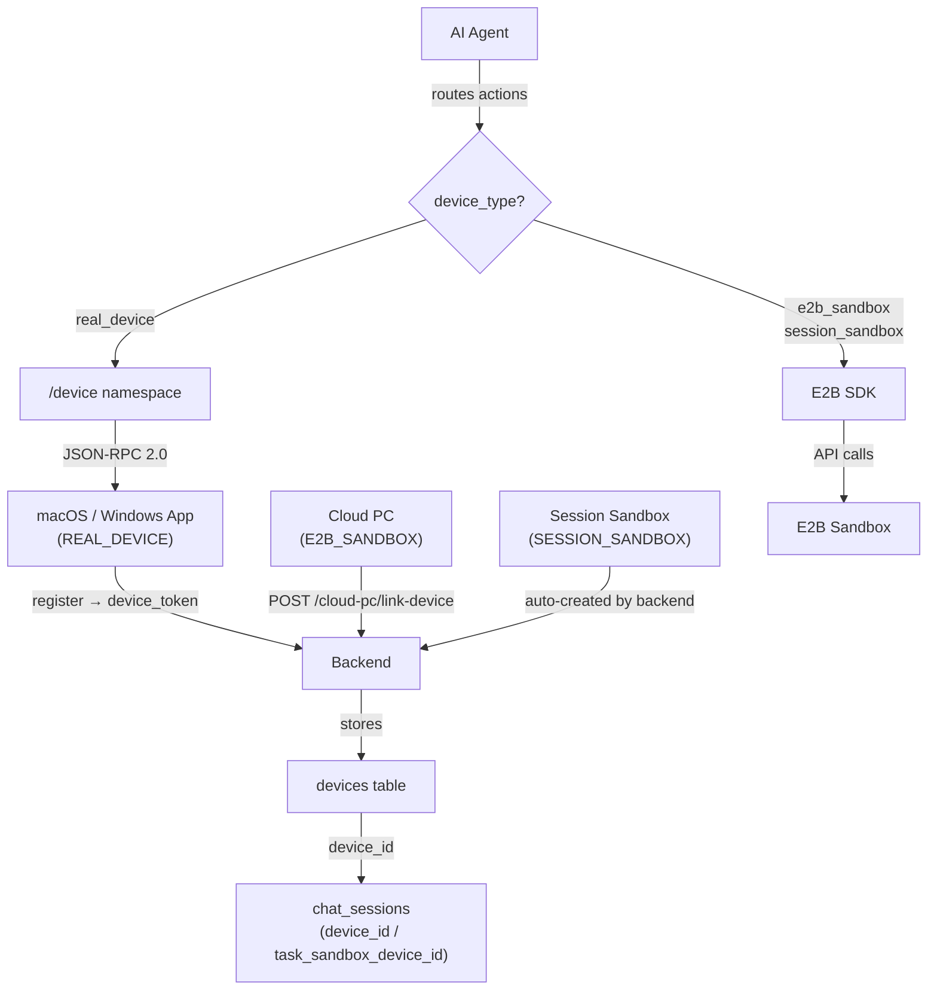
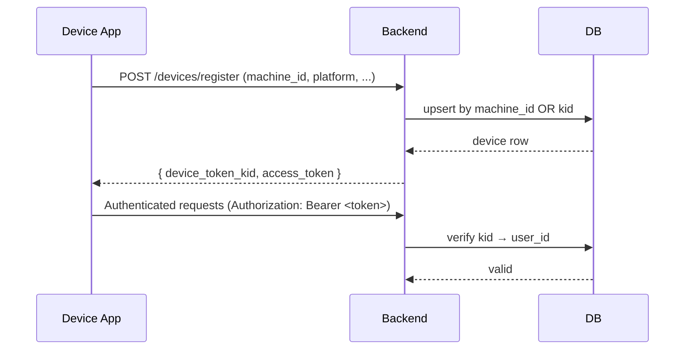
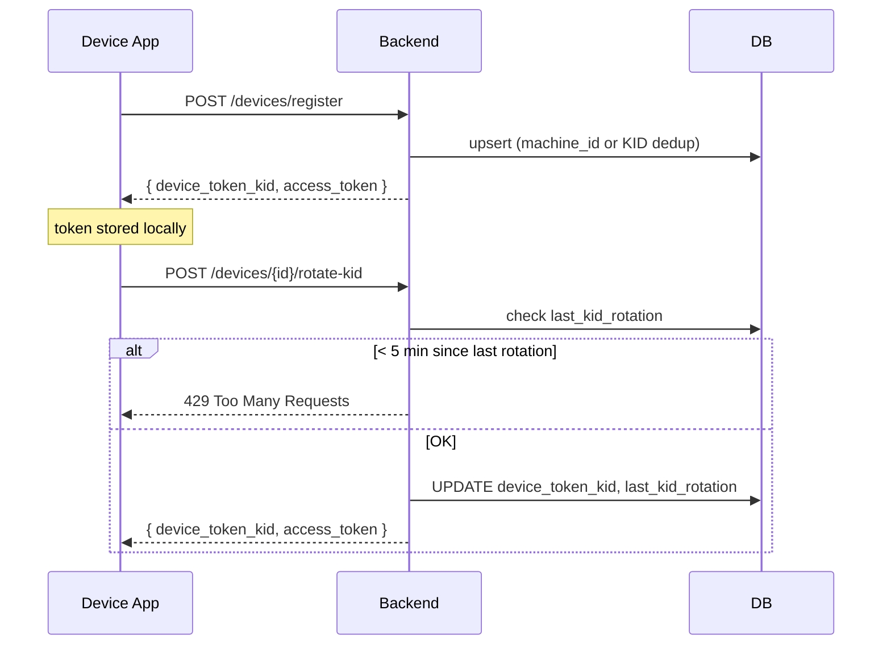
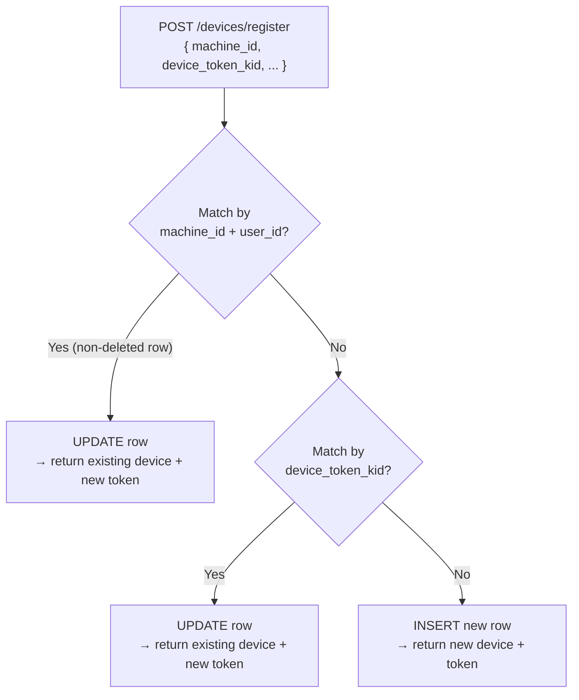

A **device** is the execution target where AI agent actions land. Every device has a persistent DB record that the backend and agent use to route Socket.IO commands, verify tokens, and track connectivity. Skygen supports three device types, each with distinct registration paths and action-routing semantics.

## Device types

`DeviceType` enum (source: `Backend/app/models/devices.py`):

| Type | Value | What it represents | Routing |
|------|-------|-------------------|---------|
| `REAL_DEVICE` | `real_device` | macOS or Windows app installed on a physical machine | Socket.IO `/device` namespace |
| `E2B_SANDBOX` | `e2b_sandbox` | Virtual device record linked to a Cloud PC | E2B SDK (direct) |
| `SESSION_SANDBOX` | `session_sandbox` | Disposable per-session Compute V2 sandbox | E2B SDK (direct) |

**Routing rule:** The agent checks `device.device_type` — not `connection_status` — to decide how to execute an action. Real devices require `connection_status == "online"`; E2B-backed devices are always routable when the sandbox is live.

## Architecture



## Data model

Source: `Backend/app/models/devices.py`

| Column | Type | Description |
|--------|------|-------------|
| `id` | `String(36)` UUID | Primary key |
| `device_name` | `String` | Display name (e.g. "MacBook Pro", "Cloud PC · My Desktop") |
| `platform` | `String` | One of `macos`, `windows`, `linux`, `desktop` |
| `capabilities` | `JSON` | Freeform dict reported by the client app at registration |
| `device_type` | `DeviceType` | `real_device` / `e2b_sandbox` / `session_sandbox` |
| `device_token_kid` | `String` | Key ID for the device JWT (unique, indexed) |
| `machine_id` | `String` | Hardware UUID (e.g. `IOPlatformUUID` on macOS); used for deduplication |
| `connection_status` | `String` | `"online"` \| `"offline"` \| `"deleted"` |
| `last_seen` | `DateTime` | Last heartbeat from the device |
| `last_kid_rotation` | `DateTime` | Timestamp of last token-key rotation (rate-limited to 1 per 5 minutes) |
| `sandbox_config` | `JSON` | E2B-specific config: `{template_id, sandbox_id, stream_url, …}` |
| `deleted_at` | `DateTime` | Soft-delete timestamp |
| `user_id` | FK → `users` | Owner |

## API reference

### Register a device

<ParamField path="POST /devices/register" type="endpoint">
Register a new device or upsert an existing one. The backend resolves deduplication in this order:

1. **By `machine_id`** — if a non-deleted device with the same `machine_id` and `user_id` exists, update it and return its existing token.
2. **By `device_token_kid`** — if a device with the same KID exists, update it.
3. **New device** — insert a new row, generate a `device_token_kid`, and issue a JWT.

**Request body:**

<ParamField body="device_name" type="string" required>
  Human-readable name for the device.
</ParamField>

<ParamField body="platform" type="string" required>
  One of `macos`, `windows`, `linux`, `desktop`.
</ParamField>

<ParamField body="capabilities" type="object">
  Freeform dict of device capabilities reported by the client (e.g. `{ "screen_recording": true }`).
</ParamField>

<ParamField body="device_type" type="string" default="real_device">
  `real_device` or `e2b_sandbox`. `session_sandbox` devices are created internally by the backend.
</ParamField>

<ParamField body="device_id" type="string">
  Hardware UUID sent by the client app (stored as `machine_id`). Used for deduplication — the same physical machine re-registers to the same device record.
</ParamField>

<ParamField body="device_token_kid" type="string">
  Optional. If provided and matches an existing KID, the device is updated rather than created.
</ParamField>

**Response `200`:**
```json
{
  "id": "device-uuid",
  "user_id": "user-uuid",
  "device_name": "MacBook Pro",
  "platform": "macos",
  "capabilities": { "screen_recording": true },
  "device_type": "real_device",
  "device_token_kid": "kid_01J...",
  "connection_status": "offline",
  "created_at": "2026-01-15T12:00:00",
  "last_seen": null,
  "machine_id": "A1B2C3D4-...",
  "device_id": "A1B2C3D4-..."
}
```

`device_id` in the response mirrors `machine_id` for Rust client compatibility.
</ParamField>

### List devices

<ParamField path="GET /devices" type="endpoint">
Returns all non-deleted devices for the current user, including any Cloud PCs converted to device shape.

When the query parameter `include_cloud_pc=true` is passed, each active Cloud PC owned by the user is converted to a device-shaped object via `_cloud_pc_to_device_dict()` and appended to the list. This lets Cloud PCs appear in the same device picker as real devices without requiring a separate API call.

**Response `200`:**
```json
[
  {
    "id": "device-uuid",
    "device_name": "MacBook Pro",
    "platform": "macos",
    "device_type": "real_device",
    "connection_status": "online",
    "last_seen": "2026-05-08T09:00:00"
  }
]
```
</ParamField>

### Get a device

<ParamField path="GET /devices/{device_id}" type="endpoint">
Return a single device by ID. Returns `404` if the device is soft-deleted or owned by a different user.
</ParamField>

### Update a device

<ParamField path="PUT /devices/{device_id}" type="endpoint">
Update device metadata (name, platform, capabilities, `connection_status`, `last_seen`).

**Request body** (`DeviceUpdate` schema):

<ParamField body="device_name" type="string">Name update.</ParamField>
<ParamField body="platform" type="string">Platform update.</ParamField>
<ParamField body="capabilities" type="object">Capabilities update.</ParamField>
<ParamField body="connection_status" type="string" default="offline">One of `online`, `offline`, `deleted`.</ParamField>
<ParamField body="last_seen" type="datetime">Timezone-aware datetimes are stripped to naive UTC before storage.</ParamField>
</ParamField>

### Delete a device

<ParamField path="DELETE /devices/{device_id}" type="endpoint">
Soft-delete a device. Sets `connection_status = "deleted"` and `deleted_at = now()`. The device record is retained for historical FK references.
</ParamField>

### Token key rotation

<ParamField path="POST /devices/{device_id}/rotate-kid" type="endpoint">
Rotate the `device_token_kid` and issue a new JWT. Rate-limited: only one rotation per **5-minute window** per device (enforced via `last_kid_rotation`).

**Response `200`:**
```json
{
  "device_token_kid": "kid_02K...",
  "access_token": "eyJ..."
}
```

Returns `429` if the last rotation was less than 5 minutes ago.
</ParamField>

## Authentication flow

Devices authenticate with a **device token** (JWT signed with the platform secret). The `device_token_kid` field in the device row acts as the key ID claim; the backend validates it on every authenticated request from the device.



## Chat session bindings

A `ChatSession` row has three device FK columns that reflect different usage scenarios:

| Column | DeviceType | Purpose |
|--------|------------|---------|
| `device_id` | Any | The primary active device for this session |
| `task_sandbox_device_id` | `SESSION_SANDBOX` | Compute V2 per-session sandbox running alongside the primary device |
| `paused_device_id` | `E2B_SANDBOX` | Memo written when a Cloud PC auto-pauses; cleared on resume |

When a Cloud PC is connected, `device_id` is set to the Cloud PC's `linked_device_id`. On auto-pause, the backend moves `device_id → paused_device_id` (so the session is no longer actively bound) and can restore it later.

## Platform capabilities

The `capabilities` JSON field is open-ended and reported by the client at registration. Common keys:

| Key | Type | Meaning |
|-----|------|---------|
| `screen_recording` | bool | App has screen-recording permission |
| `accessibility` | bool | Accessibility API enabled (required for CUA on macOS) |
| `resolution` | `[w, h]` | Screen resolution |
| `os_version` | string | Operating system version string |

Agents can read this dict to decide whether a given action is feasible on the target device before submitting it.

## Connection status

Real devices update `connection_status` and `last_seen` via Socket.IO heartbeats on the `/device` namespace. When the Socket.IO connection drops, the server sets status to `"offline"`.

| Status | Meaning |
|--------|---------|
| `online` | Socket.IO connection is active |
| `offline` | Disconnected; last_seen is the last known contact time |
| `deleted` | Soft-deleted; excluded from normal list queries |

<Warning>
**E2B-backed devices ignore `connection_status`.** The agent router does NOT check `connection_status` for `e2b_sandbox` or `session_sandbox` devices — it routes directly to the E2B SDK. Only `real_device` types must be `online` for actions to succeed.
</Warning>

## E2B sandbox device creation

Cloud PC devices are not created via `POST /devices/register`. They are created by `POST /cloud-pc/link-device`, which calls `_cloud_pc_to_device_dict()` internally. The device `platform` is set to `"desktop"`, `device_type` is `"e2b_sandbox"`, and `sandbox_config` stores the E2B-specific fields:

```json
{
  "sandbox_id": "snd_01J...",
  "stream_url": "wss://...",
  "template_id": "desktop"
}
```

## Socket.IO `/device` namespace

Real devices maintain a long-lived Socket.IO connection on the `/device` namespace.

**Events the device sends:**

| Event | Purpose |
|-------|---------|
| `register` | Announce presence with `device_token_kid` |
| `heartbeat` | Keep-alive; updates `last_seen` and `connection_status = online` |
| `action_result` | Return the result of an agent-dispatched action |
| `task_completed` | Notify the backend that a task has finished |

**Events the device receives:**

| Event | Purpose |
|-------|---------|
| `execute_action` | Agent dispatches an action for the device to run |
| `cancel_task` | Backend requests task cancellation |
| `device_config` | Backend pushes updated config (e.g. new token after KID rotation) |

## Gotchas

<Note>
**`device_id` alias.** The client sends the hardware UUID as `device_id` in the registration body; the backend stores it as `machine_id`. The response mirrors `machine_id → device_id` so the Rust client dedup logic works. Do not confuse the body alias with the primary key `id`.
</Note>

<Warning>
**KID rotation rate limit.** Only one token rotation per 5-minute window is allowed. Attempting a second rotation within the window returns `429 Too Many Requests`. Build your client refresh logic with this constraint in mind — do not retry aggressively.
</Warning>

<Note>
**Soft delete preserves FK integrity.** Deleting a device sets `deleted_at` and `connection_status = "deleted"` but keeps the row. Chat sessions with `device_id` pointing to soft-deleted devices are unaffected; the FK on `chat_sessions` is `ON DELETE SET NULL`.
</Note>

## Device token lifecycle

When a new device registers or an existing device's KID is rotated, the backend issues a **device JWT**. This token is distinct from the user's access token.



Clients should proactively rotate the KID on a schedule (e.g., every 24 hours) rather than waiting for a `401`. KID rotation invalidates the old JWT immediately.

## Session sandbox (Compute V2)

`SESSION_SANDBOX` devices are created automatically by the backend when Compute V2 is enabled for a session. Unlike `E2B_SANDBOX` (Cloud PC) devices which persist across sessions, a session sandbox is:

- Provisioned at the start of the session.
- Bound to `chat_sessions.task_sandbox_device_id` (not `device_id`).
- Destroyed at the end of the session.
- Never registered via `POST /devices/register` — created internally.

This allows a session to use a **primary device** (Cloud PC or real machine) for user-visible automation while running isolated sub-tasks in a disposable sandbox.

## Capability negotiation

When a device registers, it reports its `capabilities` dict. The agent reads this before submitting an action to determine feasibility:

```python
# Pseudo-code in CUA_OrchestratorAgent
if not device.capabilities.get("screen_recording"):
    raise ValueError("Screen recording not available on this device")

if not device.capabilities.get("accessibility"):
    raise ValueError("Accessibility API required for click automation on macOS")
```

This prevents the agent from attempting actions that will fail silently. The capability dict is freeform and client-defined — there is no schema enforcement at the API layer.

## Multi-platform support

The `platform` field identifies the OS. Action implementations vary by platform:

| Platform | CUA implementation | Notes |
|----------|-------------------|-------|
| `macos` | Accessibility API + CoreGraphics | Requires accessibility permission in System Settings |
| `windows` | Win32 API + UIAutomation | Requires elevated permissions for some operations |
| `linux` | X11 / xdotool | Typically inside a containerised E2B sandbox |
| `desktop` | E2B sandbox (always Linux) | Used for Cloud PC and session sandbox devices |

The agent's `TargetEnv.from_platform(platform)` call maps the platform string to the correct action toolkit.

## Indexes

```sql
-- All active devices for a user (used in device picker)
CREATE INDEX ON devices (user_id, deleted_at);

-- Device lookup by machine_id (deduplication on register)
CREATE INDEX ON devices (machine_id);

-- Device lookup by KID (authentication on every request)
CREATE UNIQUE INDEX ON devices (device_token_kid);
```

## Device registration walkthrough

<Steps>
  <Step title="App launches">
    On first launch, the macOS/Windows app reads the hardware UUID (e.g., `IOPlatformUUID` on macOS via `ioreg -rd1 -c IOPlatformExpertDevice`).
  </Step>
  <Step title="Register the device">
    ```bash
    curl -X POST https://api.skygen.ai/devices/register \
      -H "Authorization: Bearer <user_token>" \
      -H "Content-Type: application/json" \
      -d '{
        "device_name": "MacBook Pro",
        "platform": "macos",
        "device_id": "A1B2C3D4-E5F6-7890-ABCD-EF1234567890",
        "capabilities": {
          "screen_recording": true,
          "accessibility": true,
          "resolution": [2560, 1600]
        }
      }'
    ```
    Returns `{ "id": "device-uuid", "device_token_kid": "kid_...", "access_token": "eyJ..." }`.
  </Step>
  <Step title="Store the token">
    Store `device_token_kid` and `access_token` in the app's secure storage. Use the `access_token` as `Authorization: Bearer <token>` on all subsequent API calls.
  </Step>
  <Step title="Connect to Socket.IO">
    Connect to `wss://api.skygen.ai/device` with the device token. Send a `register` event immediately after connecting to announce presence.
  </Step>
  <Step title="Maintain heartbeat">
    Send `heartbeat` events every 30 seconds to keep `connection_status = "online"`. On disconnect (network drop, app close), the server sets `connection_status = "offline"` when the Socket.IO connection times out.
  </Step>
</Steps>

## Deduplication priority

The register endpoint resolves conflicts in a strict priority order:



This ensures re-installing the app on the same machine does not create a duplicate device record, while allowing the same user to have multiple devices.

## See also

- [Cloud PC](/concepts/cloud-pc) — how Cloud PCs create and link `E2B_SANDBOX` devices
- [Agents](/concepts/agents) — how agent action routing uses `device_type`
- [Chat sessions](/concepts/chat-sessions) — the three device FK slots on a session
- [Agent modes](/concepts/agent-modes) — how `auto` mode checks device liveness before dispatching
