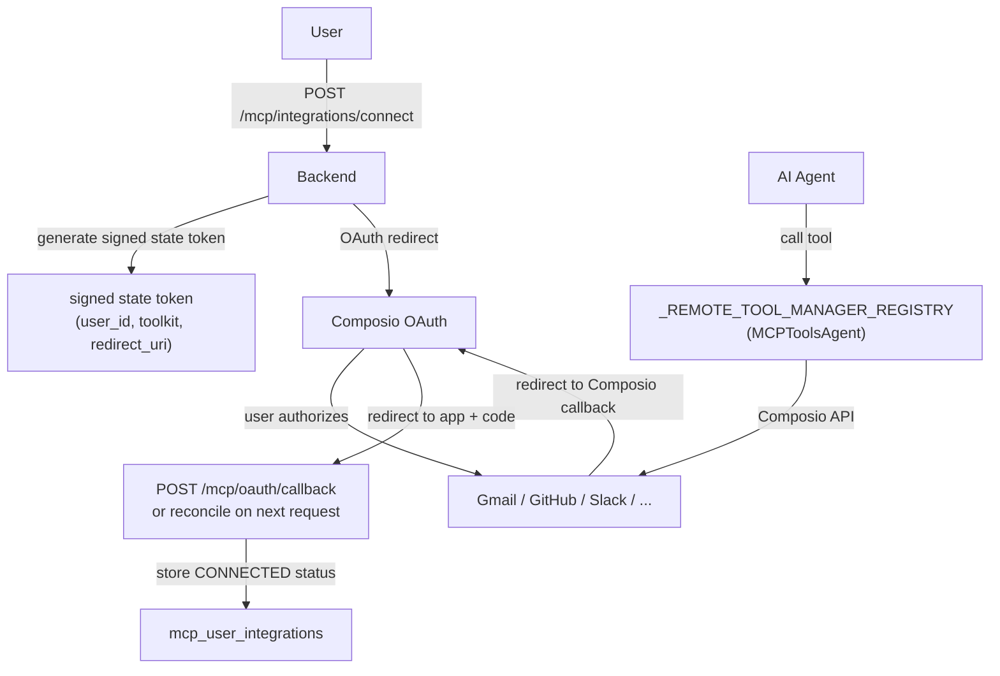
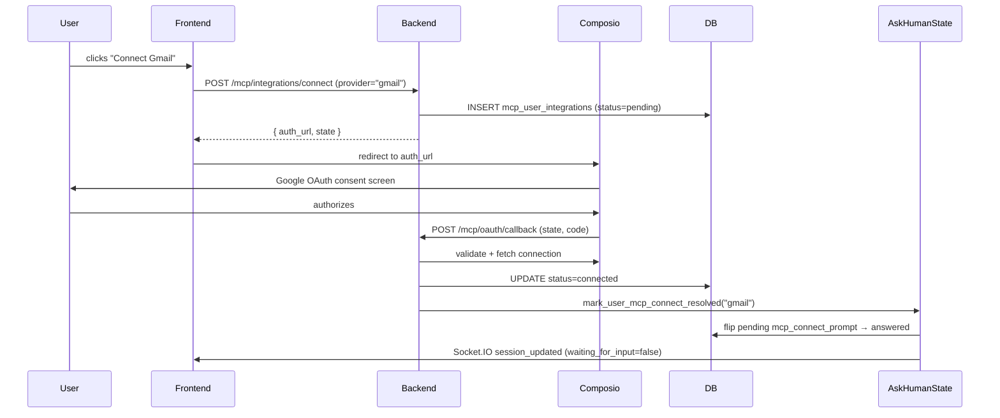
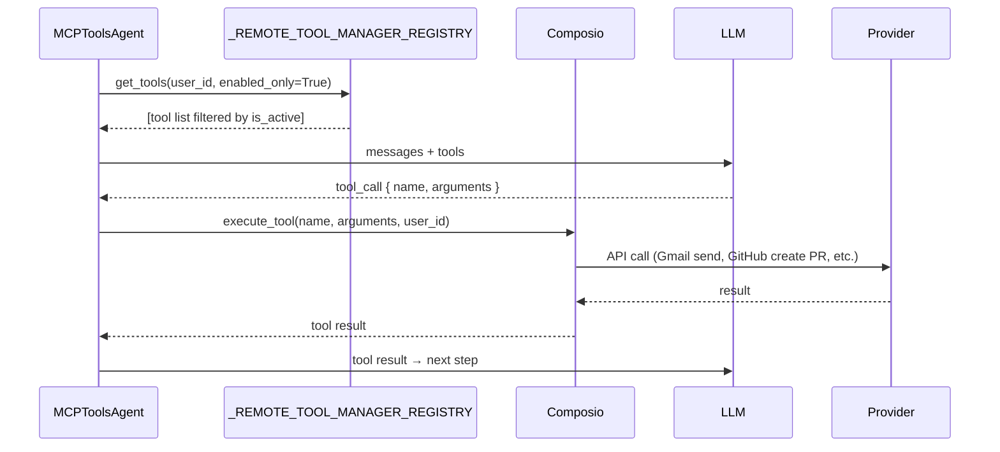

**MCP integrations** connect Skygen to external services (Gmail, GitHub, Slack, Google Calendar, and more) so that agents can call their APIs as tools. Most integrations use **Composio** as the OAuth and tool-execution delegate. Telegram is the only integration still using a custom token store.

## Architecture



## Data model

Source: `Backend/app/models/mcp.py`

### `MCPIntegration`

One row per supported provider. Admin-managed.

| Column | Type | Description |
|--------|------|-------------|
| `id` | `Integer` | Primary key |
| `provider` | `MCPIntegrationProvider` enum | Provider slug (e.g. `gmail`, `github`) |
| `display_name` | `String(255)` | UI label |
| `description` | `Text` | User-facing description |
| `scopes` | `JSON` | OAuth scopes requested |
| `settings` | `JSON` | Provider-specific settings |

### `MCPUserIntegration`

One row per user per connected integration.

| Column | Type | Description |
|--------|------|-------------|
| `id` | `String(36)` UUID | Primary key |
| `user_id` | FK → `users` | Owner |
| `integration_id` | FK → `mcp_integrations` | Which integration |
| `status` | `MCPUserIntegrationStatus` | `pending` / `connected` / `revoked` |
| `account_label` | `String(255)` | e.g. "work@example.com" |
| `is_active` | `Boolean` | Whether this connection is currently in use |
| `scopes` | `JSON` | Granted scopes |
| `extra_data` | `JSON` | Provider-specific extra fields |

### `MCPToken`

Custom token store. Only used for Telegram. All other providers delegate storage to Composio.

| Column | Type | Description |
|--------|------|-------------|
| `access_token_enc` | `Text` | Encrypted access token |
| `refresh_token_enc` | `Text` | Encrypted refresh token |
| `token_payload` | `JSON` | Provider token metadata |
| `expires_at` | `DateTime` | Expiry timestamp |
| `last_refreshed_at` | `DateTime` | Last refresh timestamp |

## Supported providers

`MCPIntegrationProvider` enum:

| Slug | Service | Via |
|------|---------|-----|
| `gmail` | Google Mail | Composio |
| `calendar` | Google Calendar | Composio |
| `contacts` | Google Contacts | Composio |
| `drive` | Google Drive | Composio |
| `docs` | Google Docs | Composio |
| `sheets` | Google Sheets | Composio |
| `youtube` | YouTube | Composio |
| `outlook` | Microsoft Outlook | Composio |
| `github` | GitHub | Composio |
| `notion` | Notion | Composio |
| `presenton` | Presenton | Composio |
| `slack` | Slack | Composio |
| `telegram` | Telegram | Custom (legacy) |
| `zoom` | Zoom | Composio (filtered from UI) |

<Note>
`zoom` is retained in the enum for DB compatibility but is filtered out of the user-facing integrations list.
</Note>

## Integration status

`MCPUserIntegrationStatus`:

| Status | Meaning |
|--------|---------|
| `pending` | OAuth flow started but not yet completed |
| `connected` | OAuth completed successfully; tokens stored in Composio |
| `revoked` | User disconnected, or provider-side revocation detected |

## API reference

### List available integrations

<ParamField path="GET /mcp/integrations/available" type="endpoint">
Returns all supported integrations with the current user's connection status for each.

**Side effect:** Triggers `reconcile_pending_connections` — checks Composio for any connections that completed outside the normal callback path (e.g., the user authorized on mobile while the desktop had a pending OAuth session). Any connections now active on Composio are set to `connected` in the DB without requiring another explicit callback.

**Response `200`:**
```json
[
  {
    "id": 1,
    "provider": "gmail",
    "display_name": "Gmail",
    "description": "Read and send emails from your Gmail account",
    "user_status": "connected",
    "account_label": "work@example.com",
    "is_active": true
  },
  {
    "id": 2,
    "provider": "github",
    "display_name": "GitHub",
    "description": "Access repositories, issues, and pull requests",
    "user_status": null,
    "account_label": null,
    "is_active": false
  }
]
```

`user_status` is `null` when the user has never started the OAuth flow for this provider.
</ParamField>

### Start OAuth connection

<ParamField path="POST /mcp/integrations/connect" type="endpoint">
Initiate the OAuth flow for a provider.

**Request body:**

<ParamField body="provider" type="string" required>
  Provider slug (e.g. `"gmail"`).
</ParamField>

<ParamField body="redirect_uri" type="string">
  Where to redirect after OAuth completes. Defaults to the platform's callback URL.
</ParamField>

**Response `200`:**
```json
{
  "auth_url": "https://composio.dev/oauth/...",
  "state": "eyJ...",
  "user_integration_id": "integration-uuid"
}
```

Redirect the user to `auth_url`. The `state` parameter is a signed JWT containing `user_id`, `toolkit`, and `redirect_uri`. Composio verifies the signature on the callback.

The row in `mcp_user_integrations` is created with `status = "pending"` at this point.
</ParamField>

### OAuth callback

<ParamField path="POST /mcp/oauth/callback" type="endpoint">
Handles the callback from Composio after the user authorizes. Validates the `state` JWT, retrieves the connection from Composio, updates `mcp_user_integrations` to `connected`, and resolves any `mcp_connect_prompt` ask_human rows for this toolkit.

This endpoint is also called programmatically during reconciliation — see `reconcile_pending_connections`.

**Side effect:** Calls `mark_user_mcp_connect_resolved(user_id, toolkit)` in `ask_human_state`, which flips any pending `mcp_connect_prompt` ask_human messages to `"answered"` across all the user's sessions and recomputes `waiting_for_input`.
</ParamField>

### Disconnect

<ParamField path="POST /mcp/integrations/{integration_id}/disconnect" type="endpoint">
Revoke a user's connection to an integration. Sets `status = "revoked"` and `is_active = false`. If the integration uses Composio, revokes the connection on Composio's side too.

**Response `200`:**
```json
{ "status": "revoked" }
```
</ParamField>

### Toggle active state

<ParamField path="PATCH /mcp/integrations/{integration_id}/toggle" type="endpoint">
Enable or disable an integration without revoking it. Sets `is_active` to the specified value. When disabled, the agent's tool registry (`_REMOTE_TOOL_MANAGER_REGISTRY`) excludes this toolkit from available tools.

**Request:** `{ "is_active": false }`
</ParamField>

### Triggers (agent-facing)

<ParamField path="GET /mcp/triggers" type="endpoint">
Returns the list of available Composio triggers for the user's connected integrations. Used by the agent to set up event-based automation (e.g., "run when a new email arrives").

**Side effect:** Also triggers `reconcile_pending_connections` as a backstop in case the user authorized OAuth during the current session.
</ParamField>

## OAuth flow



## Reconciliation backstop

Composio sometimes redirects the user to `app.skygen.ai/` after OAuth instead of the registered `/mcp/oauth/callback`. To handle this, the backend runs `reconcile_pending_connections` as a hook on:

- `GET /mcp/integrations/available`
- `GET /mcp/triggers`

The reconcile function queries Composio for all `ACTIVE` connections belonging to the user, compares against the `pending` rows in `mcp_user_integrations`, and marks any matches `connected`. A Redis `SETNX` dedup key prevents the same reconciliation from firing more than once per minute.

## Mid-session toggle

The `_REMOTE_TOOL_MANAGER_REGISTRY` in `MCPToolsAgent` is a session-scoped registry of active Composio toolkit handles. When the user toggles an integration off via the Settings panel mid-session:

1. The frontend calls `PATCH /mcp/integrations/{id}/toggle` with `is_active = false`.
2. The backend updates the DB.
3. The next agent call re-evaluates `is_active` for each toolkit and removes the disabled one from the registry.
4. The agent reports only the remaining tools to the LLM.

No in-flight tool calls are interrupted. Only new agent calls respect the toggle.

## Telegram (custom flow)

Telegram does not go through Composio. The flow:

1. User provides a bot token and chat ID.
2. The backend stores `access_token_enc` in `MCPToken` (AES-encrypted at rest).
3. The agent calls Telegram Bot API directly using the stored token.

The `MCPToken` table exists only for this legacy integration. Do not add new providers here.

## Gotchas

<Warning>
**`mcp_connect_prompt` resolves toolkit-specifically.** `mark_user_mcp_connect_resolved` only flips ask_human rows whose `providers[].toolkit_slug` matches the authorized toolkit. A pending Slack connection will NOT be resolved when Gmail completes. Each OAuth callback resolves exactly one toolkit's ask_human messages.
</Warning>

<Note>
**Composio connection status vs. Skygen status.** `MCPUserIntegration.status` reflects what Skygen has verified. If the user revokes access directly on Google/GitHub without going through Skygen's disconnect flow, the Skygen status will show `connected` until the next reconciliation or failed tool call triggers a status update.
</Note>

<Warning>
**`zoom` is filtered from UI but exists in DB.** If you query `mcp_integrations` directly, you will see a `zoom` row. The API endpoint `/mcp/integrations/available` filters it out. Do not add Zoom to UI flows without first checking the Composio connection status.
</Warning>

## Integration status transitions

```mermaid
stateDiagram-v2
    [*] --> pending : POST /mcp/integrations/connect
    pending --> connected : OAuth callback OR reconcile
    connected --> revoked : POST /mcp/integrations/{id}/disconnect
    revoked --> pending : POST /mcp/integrations/connect (re-authorize)
    connected --> connected : PATCH /toggle (is_active flip; status unchanged)
```



`is_active` is independent of `status`. A connection can be `connected` but `is_active = false` (user temporarily disabled it). The agent respects `is_active` when building the tool registry.

## Adding a new integration

New integrations must be added to both the `MCPIntegrationProvider` enum and the `mcp_integrations` table. For Composio-backed providers:

<Steps>
  <Step title="Add to the enum">
    Add the new slug to `MCPIntegrationProvider` in `Backend/app/models/mcp.py`. The enum value must match the Composio toolkit slug exactly.
  </Step>
  <Step title="Create an Alembic migration">
    Add a new `mcp_integrations` row with `provider`, `display_name`, `description`, and `scopes`.
  </Step>
  <Step title="Wire the frontend">
    The new provider appears automatically in `GET /mcp/integrations/available` once the DB row exists. The frontend renders it in the integrations grid using the `display_name`, `description`, and provider slug.
  </Step>
  <Step title="Test the OAuth flow">
    Call `POST /mcp/integrations/connect` with the new provider slug and verify the Composio redirect and callback work end-to-end.
  </Step>
</Steps>

## Tool call lifecycle

When an agent calls a Composio tool:



The `_REMOTE_TOOL_MANAGER_REGISTRY` is a session-scoped dict. `apply_toolkit_toggle_for_user` is called at the start of each `MCPToolsAgent` run to filter out disabled toolkits.

## Token storage

Only the legacy Telegram integration uses the `MCPToken` table. Token fields:

| Field | Encryption | Notes |
|-------|-----------|-------|
| `access_token_enc` | AES (app-level) | Required |
| `refresh_token_enc` | AES (app-level) | Optional; used for refresh flow |
| `token_payload` | Plaintext JSON | Non-sensitive metadata (scopes, user info) |
| `expires_at` | — | UTC; the token refresh service checks this |

For all Composio integrations, tokens are stored and managed by Composio. Skygen does not store OAuth tokens for these providers.

## Connecting an integration: full walkthrough

<Steps>
  <Step title="Fetch available integrations">
    ```bash
    GET /mcp/integrations/available
    ```
    Returns the list of providers with `connection_status` per user. This call also triggers `reconcile_pending_connections` — any OAuth callbacks that arrived without a toolkit hint are matched here.
  </Step>
  <Step title="Initiate OAuth">
    ```bash
    POST /mcp/integrations/connect
    { "provider": "github", "redirect_uri": "https://app.skygen.ai/mcp/callback" }
    ```
    Backend generates a signed state JWT and returns a `redirect_url` to Composio's OAuth consent page. Redirect the user there.
  </Step>
  <Step title="Handle callback">
    After the user authorises, Composio redirects to your `redirect_uri` with an `?integration_id=` query parameter. The frontend calls:
    ```bash
    POST /mcp/oauth/callback
    { "integration_id": "composio-integration-id", "toolkit": "github" }
    ```
    The backend marks the user's `MCPUserIntegration` row as `connected`.
  </Step>
  <Step title="Verify connection">
    ```bash
    GET /mcp/integrations/available
    ```
    The `connection_status` for the provider should now be `connected`.
  </Step>
</Steps>

## Integration API via multiple clients

<CodeGroup>

```bash cURL
# List available integrations
curl https://api.skygen.ai/mcp/integrations/available \
  -H "Authorization: Bearer $TOKEN"

# Connect GitHub
curl -X POST https://api.skygen.ai/mcp/integrations/connect \
  -H "Authorization: Bearer $TOKEN" \
  -H "Content-Type: application/json" \
  -d '{"provider": "github", "redirect_uri": "https://app.skygen.ai/callback"}'

# Disconnect GitHub
curl -X POST https://api.skygen.ai/mcp/integrations/disconnect \
  -H "Authorization: Bearer $TOKEN" \
  -H "Content-Type: application/json" \
  -d '{"provider": "github"}'

# Toggle a toolkit off
curl -X POST https://api.skygen.ai/mcp/integrations/toggle \
  -H "Authorization: Bearer $TOKEN" \
  -H "Content-Type: application/json" \
  -d '{"provider": "github", "is_active": false}'
```

```javascript JavaScript
// List integrations
const integrations = await fetch('/mcp/integrations/available', {
  headers: { Authorization: `Bearer ${token}` },
}).then(r => r.json());

// Initiate OAuth
const { redirect_url } = await fetch('/mcp/integrations/connect', {
  method: 'POST',
  headers: { Authorization: `Bearer ${token}`, 'Content-Type': 'application/json' },
  body: JSON.stringify({ provider: 'github', redirect_uri: window.location.origin + '/callback' }),
}).then(r => r.json());

// Redirect the user to the OAuth page
window.location.href = redirect_url;
```

```python Python
import httpx

async def connect_integration(token: str, provider: str, redirect_uri: str):
    async with httpx.AsyncClient(headers={"Authorization": f"Bearer {token}"}) as c:
        resp = await c.post("/mcp/integrations/connect", json={
            "provider": provider,
            "redirect_uri": redirect_uri,
        })
        return resp.json()["redirect_url"]
```

</CodeGroup>

## Error responses

| Scenario | HTTP | Body |
|----------|------|------|
| Provider not supported | 400 | `{"detail": "Unknown provider"}` |
| Already connected | 409 | `{"detail": "Integration already connected"}` |
| OAuth state invalid / expired | 400 | `{"detail": "Invalid or expired OAuth state"}` |
| Provider forbidden by plan | 403 | `{"detail": "Provider 'github' is disabled for this plan"}` |
| Composio API unreachable | 502 | `{"detail": "Composio API error"}` |

## See also

- [Confirmations](/concepts/confirmations) — the `mcp_connect_prompt` confirmation type that pauses the agent during OAuth
- [Agents](/concepts/agents) — how `MCPToolsAgent` uses the tool registry
- [Chat sessions](/concepts/chat-sessions) — `waiting_for_input` state driven by MCP connect prompts
- [Billing](/concepts/billing) — `forbidden_mcp_providers` plan policy
