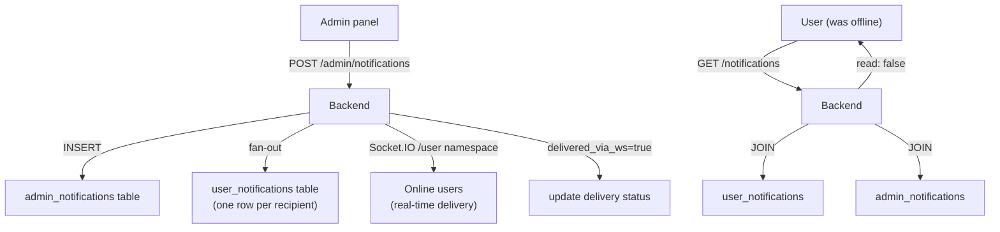
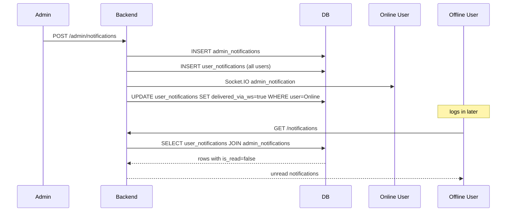

**Notifications** are persistent messages sent from admins to users (or to all users at once). They are distinct from real-time agent events: notifications survive across sessions and have explicit read tracking. They are delivered via the Socket.IO `/user` namespace and stored in Postgres for users who are offline at the time of broadcast.

## Architecture



## Data model

Source: `Backend/app/models/notifications.py`

### `AdminNotification`

One row per notification authored by an admin.

| Column | Type | Description |
|--------|------|-------------|
| `id` | `String(36)` UUID | Primary key |
| `title` | `String(255)` | Notification headline |
| `message` | `Text` | Full notification body |
| `category` | `NotificationCategory` | `updates` or `messages` |
| `icon` | `NotificationIcon` | Visual icon type |
| `target_type` | `NotificationTargetType` | `all` (broadcast) or `selected` (specific users) |
| `target_user_ids` | `JSON` | Array of user UUIDs (only used when `target_type = selected`) |
| `created_by` | `String(255)` | Admin email or name |
| `created_at` | `DateTime` | Creation timestamp |
| `total_recipients` | `String(36)` | Count of users targeted |
| `delivered_count` | `String(36)` | Count successfully pushed via WebSocket |

### `UserNotification`

One row per user per notification. Tracks delivery and read state.

| Column | Type | Description |
|--------|------|-------------|
| `id` | `String(36)` UUID | Primary key |
| `user_id` | FK → `users` | Recipient |
| `notification_id` | FK → `admin_notifications` | Source notification |
| `is_read` | `Boolean` | Whether the user has acknowledged the notification |
| `read_at` | `DateTime` | Timestamp when marked read |
| `delivered_via_ws` | `Boolean` | Whether pushed over Socket.IO while user was online |
| `delivered_at` | `DateTime` | Timestamp of WebSocket delivery |
| `created_at` | `DateTime` | Row creation timestamp |

## Enums

### `NotificationCategory`

| Value | Description |
|-------|-------------|
| `updates` | System updates, new features, platform announcements |
| `messages` | Direct messages or personal announcements from the team |

### `NotificationIcon`

| Value | When to use |
|-------|------------|
| `info` | Neutral information |
| `success` | Successful operation or positive news |
| `warning` | Something the user should act on |
| `error` | Something went wrong (rare; prefer in-app errors) |
| `gift` | Promotions, token grants, special offers |
| `star` | Feature highlights, new capabilities |
| `bell` | Generic reminders |
| `message` | Direct message style |

### `NotificationTargetType`

| Value | Description |
|-------|-------------|
| `all` | Broadcast to every user in the system |
| `selected` | Send only to the user IDs listed in `target_user_ids` |

## API reference

### List notifications

<ParamField path="GET /notifications" type="endpoint">
Returns all notifications for the current user, most recent first. Joins `user_notifications` with `admin_notifications`.

**Query parameters:**

| Param | Type | Description |
|-------|------|-------------|
| `unread_only` | bool | Return only unread notifications |
| `category` | string | Filter by `updates` or `messages` |
| `limit` | int | Page size (default 50) |
| `offset` | int | Pagination offset |

**Response `200`:**
```json
[
  {
    "id": "user-notification-uuid",
    "notification_id": "admin-notification-uuid",
    "title": "New model profiles available",
    "message": "We've added Skygen Pro and Skygen Fast tiers to all paid plans.",
    "category": "updates",
    "icon": "star",
    "is_read": false,
    "read_at": null,
    "delivered_via_ws": true,
    "created_at": "2026-05-07T18:00:00"
  }
]
```
</ParamField>

### Unread count

<ParamField path="GET /notifications/unread-count" type="endpoint">
Returns the count of unread notifications for the current user. Used for the badge in the notification bell.

**Response `200`:**
```json
{ "count": 3 }
```
</ParamField>

### Mark as read

<ParamField path="POST /notifications/{notification_id}/read" type="endpoint">
Mark a single notification as read for the current user. Sets `is_read = true` and `read_at = now()`.

**Response `200`:**
```json
{ "status": "ok" }
```
</ParamField>

### Mark all as read

<ParamField path="POST /notifications/read-all" type="endpoint">
Mark all unread notifications as read for the current user.

**Response `200`:**
```json
{ "marked_count": 3 }
```
</ParamField>

### Admin: create notification

<ParamField path="POST /admin/notifications" type="endpoint">
Create and broadcast a new notification. Requires admin role.

**Request body:**

<ParamField body="title" type="string" required>
  Notification headline (max 255 characters).
</ParamField>

<ParamField body="message" type="string" required>
  Full notification body text.
</ParamField>

<ParamField body="category" type="string" default="updates">
  `updates` or `messages`.
</ParamField>

<ParamField body="icon" type="string" default="info">
  One of `info`, `success`, `warning`, `error`, `gift`, `star`, `bell`, `message`.
</ParamField>

<ParamField body="target_type" type="string" default="all">
  `all` to broadcast to everyone, `selected` to target specific users.
</ParamField>

<ParamField body="target_user_ids" type="array">
  Array of user UUID strings. Required when `target_type = selected`.
</ParamField>

**Response `201`:**
```json
{
  "id": "admin-notification-uuid",
  "title": "Scheduled maintenance",
  "message": "We will be down for maintenance on May 10 from 2:00–4:00 AM UTC.",
  "category": "updates",
  "icon": "warning",
  "target_type": "all",
  "total_recipients": "2847",
  "delivered_count": "0",
  "created_at": "2026-05-08T10:00:00"
}
```

After insertion, the backend fans out `user_notifications` rows asynchronously and pushes `admin_notification` Socket.IO events to all online recipients.
</ParamField>

### Admin: list notifications

<ParamField path="GET /admin/notifications" type="endpoint">
Returns all notifications with aggregate stats (total recipients, delivered count). Admin only.
</ParamField>

### Admin: delete notification

<ParamField path="DELETE /admin/notifications/{id}" type="endpoint">
Permanently delete a notification and all associated `user_notifications` rows (cascaded). Admin only.
</ParamField>

## Socket.IO delivery

When an admin creates a notification, the backend pushes it to all currently-connected users on the `/user` namespace.

| Event | Namespace | Payload |
|-------|-----------|---------|
| `admin_notification` | `/user` | Notification object with `user_notification_id`, `title`, `message`, `category`, `icon` |

```json
{
  "user_notification_id": "user-notification-uuid",
  "notification_id": "admin-notification-uuid",
  "title": "New model profiles available",
  "message": "We've added Skygen Pro and Skygen Fast tiers.",
  "category": "updates",
  "icon": "star",
  "created_at": "2026-05-07T18:00:00"
}
```

When the event is successfully pushed, `delivered_via_ws` and `delivered_at` are set on the `user_notifications` row, and `delivered_count` on the `admin_notifications` row is incremented.

## Delivery for offline users

Users who are offline when a notification is created receive it via the standard `GET /notifications` endpoint the next time they open the app. The `user_notifications` row is always created regardless of online status — the `delivered_via_ws` flag only indicates whether real-time push succeeded.



## Indexes

```sql
-- Fast unread badge count
CREATE INDEX idx_user_notification_user_read ON user_notifications (user_id, is_read);

-- Delivery stats lookup
CREATE INDEX idx_user_notification_notification ON user_notifications (notification_id);

-- Admin panel: recent notifications
CREATE INDEX idx_admin_notification_created ON admin_notifications (created_at);
CREATE INDEX idx_admin_notification_category ON admin_notifications (category);
```

## Gotchas

<Note>
**Notifications are broadcast-only from admin.** There is no mechanism for users to create notifications. If you need user-generated alerts (e.g., "task completed"), use the `TASK_PROGRESS` or `AGENT_RESPONSE` Socket.IO events instead — those are ephemeral and not stored in `admin_notifications`.
</Note>

<Warning>
**`total_recipients` is a string column.** The `AdminNotification.total_recipients` and `delivered_count` columns are declared as `String(36)` in the model despite holding integer values. This is a historical inconsistency. Parse as int before arithmetic operations.
</Warning>

<Note>
**`target_user_ids` is only used for `target_type = selected`.** For `target_type = all`, this field is `null` even if you pass it in the request body. The backend ignores the value when creating ALL-target notifications.
</Note>

## Notification vs. real-time event

It is important to distinguish between **persistent notifications** (this page) and **ephemeral real-time events**:

| Type | Stored in DB | Survives reconnect | Use case |
|------|-------------|-------------------|---------|
| `AdminNotification` | Yes (`admin_notifications`) | Yes | Platform announcements, feature releases, maintenance |
| `UserNotification` | Yes (`user_notifications`) | Yes | Per-user read tracking for admin notifications |
| `agent_response` Socket.IO event | No (message is in `chat_messages`) | No (event lost) | Final agent answer for the current session |
| `task_progress` Socket.IO event | No | No | Live task execution progress |
| `session_updated` Socket.IO event | No (state is in DB) | No (event lost) | Real-time `waiting_for_input` flag update |

Notifications are for asynchronous, admin-authored messages. For agent outputs and session state, use the `chat_messages` API and Socket.IO.

## Frontend badge pattern

The unread badge in the notification bell updates via two mechanisms:

1. **On app open** — `GET /notifications/unread-count` returns the current count.
2. **On Socket.IO `admin_notification` event** — increment the badge counter by 1 without re-fetching.

When the user opens the notification panel, call `GET /notifications?limit=20` to load notifications, then `POST /notifications/read-all` when the panel closes.

## Building a notification UI

<Steps>
  <Step title="Fetch initial count">
    ```javascript
    const { count } = await fetch('/notifications/unread-count').then(r => r.json());
    setBadge(count);
    ```
  </Step>
  <Step title="Listen for new notifications">
    ```javascript
    socket.on('admin_notification', (data) => {
      setBadge(prev => prev + 1);
      showToast(data.title, data.message, data.icon);
    });
    ```
  </Step>
  <Step title="Load notification list">
    ```javascript
    const notifications = await fetch('/notifications?limit=50').then(r => r.json());
    renderNotificationList(notifications);
    ```
  </Step>
  <Step title="Mark as read">
    ```javascript
    await fetch('/notifications/read-all', { method: 'POST' });
    setBadge(0);
    ```
  </Step>
</Steps>

## Admin use cases

Admins typically create notifications for:

- **Feature announcements** — `category: updates`, `icon: star`
- **Scheduled maintenance** — `category: updates`, `icon: warning`, `target_type: all`
- **Token grants** — after an `admin_grant` transaction, send a `category: messages`, `icon: gift` notification to the affected user(s)
- **Outage alerts** — `icon: error`, `target_type: all`
- **Personal follow-ups** — `category: messages`, `target_type: selected`, targeted at specific `user_ids`

## SQLAlchemy model snippets

Source: `Backend/app/models/notifications.py`

```python
class AdminNotification(Base):
    __tablename__ = "admin_notifications"

    id = Column(String(36), primary_key=True, ...)
    title = Column(String(255), nullable=False)
    message = Column(Text, nullable=False)
    category = Column(Enum(NotificationCategory), nullable=False)
    icon = Column(Enum(NotificationIcon), nullable=False)
    target_type = Column(Enum(NotificationTargetType), nullable=False)
    target_user_ids = Column(JSON, nullable=True)   # only used when target_type = selected

    # Delivery counters (stored as String(36) — parse as int before arithmetic)
    total_recipients = Column(String(36), nullable=True)
    delivered_count = Column(String(36), nullable=True)

    created_by = Column(String(255), nullable=True)
    created_at = Column(DateTime, default=datetime.utcnow, nullable=False)

class UserNotification(Base):
    __tablename__ = "user_notifications"

    id = Column(String(36), primary_key=True, ...)
    user_id = Column(String(36), ForeignKey("users.id", ondelete="CASCADE"), ...)
    notification_id = Column(String(36), ForeignKey("admin_notifications.id", ondelete="CASCADE"), ...)
    is_read = Column(Boolean, default=False, nullable=False)
    read_at = Column(DateTime, nullable=True)
    delivered_via_ws = Column(Boolean, default=False, nullable=False)
    delivered_at = Column(DateTime, nullable=True)
    created_at = Column(DateTime, default=datetime.utcnow, nullable=False)
```

## Working with notifications via API

<CodeGroup>

```bash cURL
# Unread count
curl https://api.skygen.ai/notifications/unread-count \
  -H "Authorization: Bearer $TOKEN"

# List unread notifications
curl "https://api.skygen.ai/notifications?unread_only=true&limit=20" \
  -H "Authorization: Bearer $TOKEN"

# Mark all read
curl -X POST https://api.skygen.ai/notifications/read-all \
  -H "Authorization: Bearer $TOKEN"

# Admin: broadcast a maintenance alert
curl -X POST https://api.skygen.ai/admin/notifications \
  -H "Authorization: Bearer $ADMIN_TOKEN" \
  -H "Content-Type: application/json" \
  -d '{
    "title": "Scheduled maintenance",
    "message": "Down for 30 min on 2026-05-10 at 02:00 UTC.",
    "category": "updates",
    "icon": "warning",
    "target_type": "all"
  }'
```

```javascript JavaScript
// Fetch unread count on app mount
async function fetchUnreadCount() {
  const { count } = await fetch('/notifications/unread-count', {
    headers: { Authorization: `Bearer ${token}` },
  }).then(r => r.json());
  return count;
}

// Increment badge in real time
socket.on('admin_notification', (data) => {
  setBadgeCount(prev => prev + 1);
  toast.info(data.title, { description: data.message });
});

// Load panel and mark all read
async function openNotificationPanel() {
  const notifications = await fetch('/notifications?limit=50').then(r => r.json());
  renderList(notifications);
  // Mark read when panel closes
  return () => {
    fetch('/notifications/read-all', { method: 'POST' });
    setBadgeCount(0);
  };
}
```

```python Python
import httpx

async def send_admin_notification(
    admin_token: str,
    title: str,
    message: str,
    category: str = "updates",
    icon: str = "info",
    target_type: str = "all",
    target_user_ids: list = None,
):
    payload = {"title": title, "message": message,
               "category": category, "icon": icon, "target_type": target_type}
    if target_user_ids:
        payload["target_user_ids"] = target_user_ids

    async with httpx.AsyncClient() as c:
        return (await c.post(
            "https://api.skygen.ai/admin/notifications",
            headers={"Authorization": f"Bearer {admin_token}"},
            json=payload,
        )).json()
```

</CodeGroup>

## Error responses

| Scenario | HTTP | Body |
|----------|------|------|
| Notification not found | 404 | `{"detail": "Notification not found"}` |
| `target_type = selected` but `target_user_ids` empty | 422 | Pydantic validation error |
| Not an admin user | 403 | `{"detail": "Forbidden"}` |

## See also

- [Agents](/concepts/agents) — real-time agent events (not stored as notifications)
- [Chat sessions](/concepts/chat-sessions) — `session_updated` events that update session state
- [Confirmations](/concepts/confirmations) — ask_human events that lock the composer
- [Billing](/concepts/billing) — `admin_grant` token grants that pair with gift notifications
