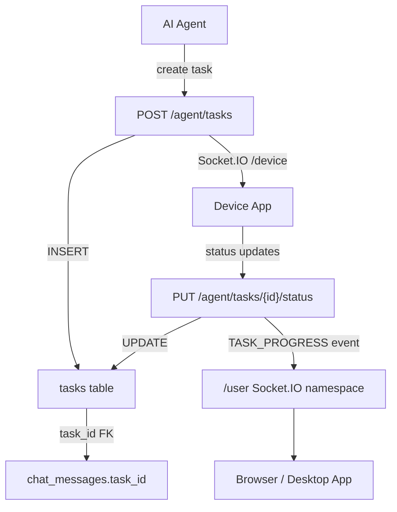
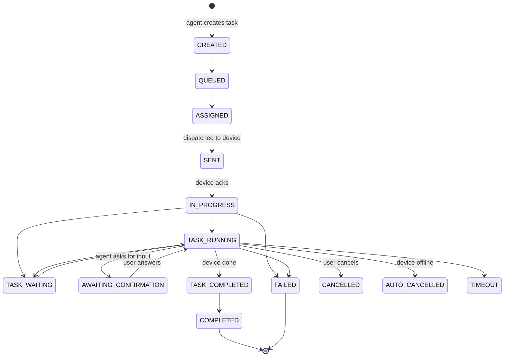
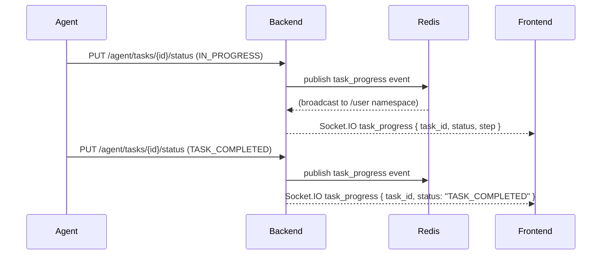

A **task** is the backend record for a single unit of work dispatched to a device. Every time an agent submits an action sequence to a device, a corresponding `tasks` row is created. Tasks carry an `idempotency_key` to prevent duplicate execution, a `payload` JSON field for agent-specific parameters, and a lifecycle status that transitions from creation to completion or failure.

## Architecture



## Data model

Source: `Backend/app/models/tasks.py`

| Column | Type | Description |
|--------|------|-------------|
| `id` | `String` UUID | Primary key |
| `user_id` | FK → `users` | Owner; `ON DELETE CASCADE` |
| `device_id` | FK → `devices` | Target device |
| `status` | `String` | Current lifecycle status (see below) |
| `title` | `String` | Human-readable task title |
| `description` | `String` | Optional extended description |
| `payload` | `JSON` | Agent-supplied parameters (tool calls, action sequences, etc.) |
| `idempotency_key` | `String` (unique) | Prevents duplicate task creation |
| `has_safety_violation` | `Boolean` | Set by the safety service if the task content triggered a policy |
| `evaluation_completed` | `Boolean` | Whether the post-task evaluation step has run |
| `created_at` | `DateTime` | Creation timestamp |
| `updated_at` | `DateTime` | Last status change (auto-updated) |

## Task status lifecycle

`TaskStatus` enum (source: `Backend/app/schemas/task.py`):

| Status | Meaning |
|--------|---------|
| `CREATED` | Row inserted; not yet queued for dispatch |
| `QUEUED` | Placed in the dispatch queue |
| `ASSIGNED` | Assigned to a specific device session |
| `SENT` | Task sent to the device via Socket.IO |
| `IN_PROGRESS` | Device acknowledged receipt and started execution |
| `TASK_RUNNING` | Device is actively running the task (long-running) |
| `TASK_WAITING` | Device is waiting for a sub-condition (e.g., page load) |
| `AWAITING_CONFIRMATION` | Agent paused; waiting for user confirmation before proceeding |
| `COMPLETED` | Task finished successfully |
| `TASK_COMPLETED` | Device-reported completion (may be followed by `COMPLETED`) |
| `FAILED` | Task encountered an unrecoverable error |
| `CANCELLED` | Cancelled by the user |
| `AUTO_CANCELLED` | Cancelled automatically (e.g., session closed, device went offline) |
| `TIMEOUT` | Exceeded the configured execution timeout |



## API reference

### Create a task

<ParamField path="POST /agent/tasks" type="endpoint">
Create a new task record and dispatch it to a device. This endpoint is called by the agent, not by the frontend directly.

**Request body** (`TaskCreate` schema):

<ParamField body="device_id" type="string" required>
  UUID of the target device.
</ParamField>

<ParamField body="title" type="string" required>
  Short human-readable description shown in the UI progress stream.
</ParamField>

<ParamField body="description" type="string">
  Optional extended description.
</ParamField>

<ParamField body="payload" type="object" default="{}">
  Agent-defined execution parameters. Shape varies by agent mode. Examples:
  - CUA: `{ "action_type": "CLICK", "coordinates": [540, 320] }`
  - SWE: `{ "file_path": "src/main.py", "change": "..." }`
</ParamField>

<ParamField body="status" type="string" default="CREATED">
  Initial status. Usually left as `CREATED`.
</ParamField>

<ParamField body="idempotency_key" type="string" required>
  Unique key (typically a UUID v4 generated by the agent). Duplicate submissions with the same key return the existing task row with `200` instead of creating a duplicate.
</ParamField>

**Response `201`:**
```json
{
  "id": "task-uuid",
  "user_id": "user-uuid",
  "device_id": "device-uuid",
  "status": "CREATED",
  "title": "Open browser and navigate to gmail.com",
  "description": null,
  "payload": { "action_type": "NAVIGATE", "url": "https://gmail.com" },
  "idempotency_key": "a1b2c3d4-...",
  "created_at": "2026-05-08T10:00:00",
  "updated_at": "2026-05-08T10:00:00"
}
```

**Idempotency:** A task with the same `idempotency_key` already exists → returns the existing row with `200`.
</ParamField>

### Update task status

<ParamField path="PUT /agent/tasks/{task_id}/status" type="endpoint">
Update the lifecycle status of a task. Called by:
- The device app (reporting `IN_PROGRESS`, `TASK_COMPLETED`, `FAILED`)
- The backend worker (transitioning to `COMPLETED`, `CANCELLED`, `TIMEOUT`)

**Request body** (`TaskUpdate` schema):

<ParamField body="status" type="string">
  New status value from `TaskStatus` enum.
</ParamField>

<ParamField body="title" type="string">
  Optional title update.
</ParamField>

<ParamField body="description" type="string">
  Optional description update.
</ParamField>

<ParamField body="payload" type="object">
  Optional payload merge (used to append execution results).
</ParamField>

**Side effect:** Every status transition triggers a `TASK_PROGRESS` event on the `/user` Socket.IO namespace with the updated task shape. The frontend uses this to update the progress indicator in the chat stream.
</ParamField>

### Get a task

<ParamField path="GET /agent/tasks/{task_id}" type="endpoint">
Returns a single task by ID. Returns `404` if not owned by the current user.

**Response `200`:** `TaskRead` schema — same shape as the create response.
</ParamField>

### List tasks

<ParamField path="GET /agent/tasks" type="endpoint">
Returns tasks for the current user. Query parameters:

| Param | Type | Description |
|-------|------|-------------|
| `device_id` | string | Filter by device |
| `status` | string | Filter by status |
| `session_id` | string | Filter by chat session (joins via `chat_messages.task_id`) |
| `limit` | int | Page size |
| `offset` | int | Pagination offset |
</ParamField>

### Cancel a task

<ParamField path="POST /agent/tasks/{task_id}/cancel" type="endpoint">
Request cancellation of an in-flight task. Transitions to `CANCELLED` and sends a `cancel_task` event to the device via Socket.IO. If the task is already in a terminal state (`COMPLETED`, `FAILED`, `CANCELLED`, `TIMEOUT`), returns `409`.
</ParamField>

## Progress reporting

Tasks emit progress events throughout execution. The frontend renders these as a live step-by-step log in the chat stream.



The `TASK_PROGRESS` event payload:

```json
{
  "task_id": "task-uuid",
  "session_id": "session-uuid",
  "status": "TASK_RUNNING",
  "title": "Clicking Sign In button",
  "step": 3,
  "total_steps": null
}
```

## Linking tasks to messages

Each `ChatMessage` has an optional `task_id` FK. When the agent generates a response that includes a task execution, the resulting assistant message is linked to the task:

```sql
SELECT cm.content, t.status, t.title
FROM chat_messages cm
JOIN tasks t ON cm.task_id = t.id
WHERE cm.session_id = :session_id
ORDER BY cm.created_at;
```

This enables the UI to show task status inline alongside the message that triggered it.

## Idempotency

The `idempotency_key` is a unique constraint on the `tasks` table. The agent generates a new UUID for each distinct action sequence. If the agent retries a failed submission with the same key:

1. The backend checks the unique index.
2. If a row exists, it returns that row with `200` (not `409`).
3. The agent continues with the existing task ID.

This prevents duplicated device actions on network retries without requiring the agent to track whether a previous call succeeded.

## Safety violations

When the safety service determines that a task payload violates content policy, it sets `has_safety_violation = true` and transitions the task to `FAILED`. The associated `chat_messages` row will have `meta_data.safety_violation = true` and a user-facing explanation in `content`.

## Gotchas

<Warning>
**`AWAITING_CONFIRMATION` blocks execution.** When a task enters `AWAITING_CONFIRMATION`, the device stops processing and the agent waits for a `confirmation_response` event. The session's `waiting_for_input` flag is set to `true`. No further tasks are dispatched until the user responds.
</Warning>

<Note>
**`TASK_COMPLETED` is not `COMPLETED`.** The device reports `TASK_COMPLETED` when it finishes local execution. The backend then transitions to `COMPLETED` after post-processing (logging, billing, evaluation). Watch for both values when polling.
</Note>

<Warning>
**`AUTO_CANCELLED` on device disconnect.** If the bound device goes offline mid-task, in-flight tasks are auto-cancelled. The frontend should notify the user and offer to reconnect before retrying.
</Warning>

## Full task create + poll example

<Steps>
  <Step title="Agent creates a task">
    ```json
    POST /agent/tasks
    {
      "device_id": "device-uuid",
      "title": "Navigate to gmail.com and open the first email",
      "payload": {
        "action_type": "NAVIGATE",
        "url": "https://gmail.com"
      },
      "idempotency_key": "a1b2c3d4-e5f6-7890-abcd-ef1234567890"
    }
    ```
  </Step>
  <Step title="Backend dispatches to device">
    The backend sends a `desktop_env_execute` event to the device via Socket.IO `/device` namespace. Task status transitions: `CREATED → QUEUED → ASSIGNED → SENT`.
  </Step>
  <Step title="Device acks and reports IN_PROGRESS">
    The device app calls `PUT /agent/tasks/{id}/status` with `{ "status": "IN_PROGRESS" }`. The backend pushes a `TASK_PROGRESS` event to the frontend.
  </Step>
  <Step title="Agent polls for completion">
    The agent polls `GET /agent/device/status/{action_id}` until the Redis result key is populated or the TTL expires. Result keys have 300-second TTL.
  </Step>
  <Step title="Task completes">
    Device reports `TASK_COMPLETED`. Backend transitions to `COMPLETED` and emits a final `TASK_PROGRESS` event.
  </Step>
</Steps>

## Idempotency key generation

The agent generates idempotency keys as UUID v4. The key is derived per logical action, not per physical submission. If the agent retries after a network timeout, it reuses the same key:

```python
# Agent pseudocode
idempotency_key = str(uuid4())  # generated once per logical action
try:
    task = await create_task(idempotency_key=idempotency_key, ...)
except NetworkError:
    # Retry with the SAME key — backend returns existing task
    task = await create_task(idempotency_key=idempotency_key, ...)
```

## Task payload conventions

The `payload` JSON field is agent-defined. Common shapes by mode:

| Mode | Payload shape |
|------|--------------|
| `cua` | `{ "action_type": "CLICK", "coordinates": [x, y], "screenshot_context": "..." }` |
| `cua` | `{ "action_type": "TYPE", "text": "hello@example.com" }` |
| `cua` | `{ "action_type": "SCREENSHOT" }` |
| `swe` | `{ "file_path": "src/auth.py", "operation": "read" }` |
| `swe` | `{ "command": "pytest tests/", "cwd": "/project" }` |
| `deep_research` | `{ "query": "AI papers May 2026", "sources": ["arxiv", "web"] }` |

The backend does not validate payload shapes — that is the agent's responsibility.

## Safety violation handling

When the safety service detects a policy violation in a task:

1. `has_safety_violation` is set to `true` on the task row.
2. The task transitions to `FAILED`.
3. The associated `chat_messages` row gets `meta_data.safety_violation = true`.
4. The user sees an explanation in the assistant message content.
5. The agent is terminated with `final_outcome = "SAFETY_VIOLATION"`.

Tasks with `has_safety_violation = true` are excluded from billing (no token deduction for the failed call).

## Evaluation

`evaluation_completed` tracks whether the post-task evaluation step has run. Evaluation is a separate async job that:

- Checks the task outcome against the session's goal.
- Writes an evaluation score and notes to the task payload.
- Used for agent quality monitoring and fine-tuning data collection.

Not all tasks are evaluated — the evaluation job samples a configurable percentage of completed tasks.

## SQLAlchemy model and Pydantic schemas

Source: `Backend/app/models/tasks.py` and `Backend/app/schemas/task.py`

```python
# ORM model (tasks.py)
class Task(Base):
    __tablename__ = "tasks"

    id = Column(String(36), primary_key=True, default=gen_uuid_str, index=True)
    user_id = Column(String(36), ForeignKey("users.id", ondelete="CASCADE"), ...)
    device_id = Column(String(36), ForeignKey("devices.id", ondelete="CASCADE"), ...)
    status = Column(String, nullable=False, default="CREATED")
    title = Column(String, nullable=False)
    description = Column(Text, nullable=True)
    payload = Column(JSON, default=dict)
    idempotency_key = Column(String, unique=True, nullable=False, index=True)
    has_safety_violation = Column(Boolean, default=False, nullable=False, index=True)
    evaluation_completed = Column(Boolean, default=False, nullable=False, index=True)
    created_at = Column(DateTime, default=datetime.utcnow, nullable=False)
    updated_at = Column(DateTime, default=datetime.utcnow, onupdate=datetime.utcnow, ...)
```

```python
# Pydantic enums and schemas (task.py)
class TaskStatus(str, Enum):
    CREATED = "CREATED"
    QUEUED = "QUEUED"
    ASSIGNED = "ASSIGNED"
    SENT = "SENT"
    IN_PROGRESS = "IN_PROGRESS"
    TASK_RUNNING = "TASK_RUNNING"
    TASK_WAITING = "TASK_WAITING"
    AWAITING_CONFIRMATION = "AWAITING_CONFIRMATION"
    COMPLETED = "COMPLETED"
    TASK_COMPLETED = "TASK_COMPLETED"
    FAILED = "FAILED"
    CANCELLED = "CANCELLED"
    AUTO_CANCELLED = "AUTO_CANCELLED"
    TIMEOUT = "TIMEOUT"

class TaskCreate(BaseModel):
    device_id: str
    status: TaskStatus = TaskStatus.CREATED
    title: str
    description: Optional[str] = None
    payload: Dict = {}
    idempotency_key: str           # required; must be unique UUID v4
```

## Task API via multiple clients

<CodeGroup>

```bash cURL
# Create a task
curl -X POST https://api.skygen.ai/agent/tasks \
  -H "Authorization: Bearer $TOKEN" \
  -H "Content-Type: application/json" \
  -d '{
    "device_id": "device-uuid",
    "title": "Open Chrome and go to github.com",
    "payload": {"action_type": "NAVIGATE", "url": "https://github.com"},
    "idempotency_key": "a1b2c3d4-e5f6-7890-abcd-ef1234567890"
  }'

# Check status
curl https://api.skygen.ai/agent/tasks/task-uuid \
  -H "Authorization: Bearer $TOKEN"

# Cancel a task
curl -X POST https://api.skygen.ai/agent/tasks/task-uuid/cancel \
  -H "Authorization: Bearer $TOKEN"
```

```javascript JavaScript
// Create
const task = await fetch('/agent/tasks', {
  method: 'POST',
  headers: { Authorization: `Bearer ${token}`, 'Content-Type': 'application/json' },
  body: JSON.stringify({
    device_id: deviceId,
    title: 'Open Chrome and go to github.com',
    payload: { action_type: 'NAVIGATE', url: 'https://github.com' },
    idempotency_key: crypto.randomUUID(),
  }),
}).then(r => r.json());

// Poll until terminal state
const poll = async (taskId) => {
  const TERMINAL = ['COMPLETED', 'FAILED', 'CANCELLED', 'AUTO_CANCELLED', 'TIMEOUT'];
  while (true) {
    const { status } = await fetch(`/agent/tasks/${taskId}`).then(r => r.json());
    if (TERMINAL.includes(status)) return status;
    await new Promise(r => setTimeout(r, 1000));
  }
};
```

```python Python
import httpx, uuid

async def create_and_wait(token, device_id, title, payload):
    async with httpx.AsyncClient(headers={"Authorization": f"Bearer {token}"}) as c:
        task = (await c.post("/agent/tasks", json={
            "device_id": device_id,
            "title": title,
            "payload": payload,
            "idempotency_key": str(uuid.uuid4()),
        })).json()

        terminal = {"COMPLETED", "FAILED", "CANCELLED", "AUTO_CANCELLED", "TIMEOUT"}
        while True:
            t = (await c.get(f"/agent/tasks/{task['id']}")).json()
            if t["status"] in terminal:
                return t
            await asyncio.sleep(1)
```

</CodeGroup>

## Error responses

| Scenario | HTTP | Body |
|----------|------|------|
| Duplicate `idempotency_key` (same submitter) | 200 | Existing task row |
| Task not found or not owned by user | 404 | `{"detail": "Task not found"}` |
| Cancel a terminal task | 409 | `{"detail": "Task is already in terminal state"}` |
| Missing required field | 422 | Pydantic validation error |

## See also

- [Agents](/concepts/agents) — the agent action lifecycle and Redis state
- [Devices](/concepts/devices) — routing device actions by device type
- [Chat sessions](/concepts/chat-sessions) — how tasks link to sessions via `chat_messages.task_id`
- [Confirmations](/concepts/confirmations) — the `AWAITING_CONFIRMATION` state in practice
- [Billing](/concepts/billing) — how completed task costs become token transactions
